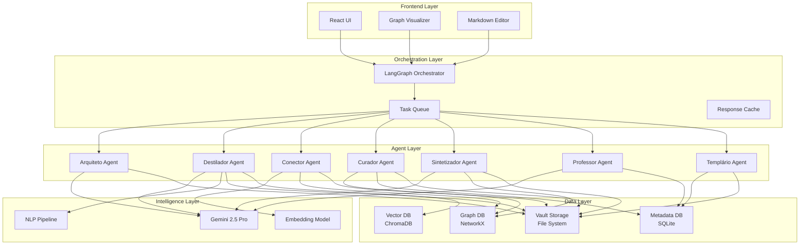

# 🏗️ Proposta de Arquitetura Técnica - Cerebrum

## Visão Geral do Sistema



---

## Stack Tecnológico Detalhado

### **Backend (Python 3.11+)**

```python
# pyproject.toml
[tool.poetry.dependencies]
python = "^3.11"

# API Framework
fastapi = "^0.104.0"
uvicorn = "^0.24.0"
pydantic = "^2.5.0"

# Agent Orchestration
langgraph = "^0.0.40"
langchain = "^0.1.0"
langchain-google-genai = "^0.0.6"

# Vector & Embeddings
chromadb = "^0.4.18"
sentence-transformers = "^2.2.2"

# Graph Analysis
networkx = "^3.2"
python-louvain = "^0.16"  # Community detection

# NLP
spacy = "^3.7.2"
transformers = "^4.35.0"

# Utilities
pypdf2 = "^3.0.1"  # PDF parsing
python-frontmatter = "^1.0.0"  # YAML frontmatter
watchdog = "^3.0.0"  # File system monitoring
apscheduler = "^3.10.4"  # Cron jobs
```

### **Frontend (TypeScript)**

```json
{
  "dependencies": {
    "react": "^19.1.1",
    "react-dom": "^19.1.1",
    "@google/genai": "^1.15.0",

    // Graph Visualization
    "reactflow": "^11.10.0",
    "@visx/visx": "^3.8.0",

    // Advanced Editor
    "@monaco-editor/react": "^4.6.0",
    "@uiw/react-md-editor": "^4.0.0",

    // State Management
    "zustand": "^4.4.7",
    "@tanstack/react-query": "^5.14.0",

    // Utilities
    "react-markdown": "^9.0.1",
    "remark-gfm": "^4.0.0",
    "date-fns": "^3.0.0",
    "lodash-es": "^4.17.21"
  }
}
```

---

## Estrutura de Pastas (Monorepo)

```
cerebrum/
├── backend/
│   ├── agents/
│   │   ├── base_agent.py           # Abstract base class
│   │   ├── architect.py
│   │   ├── distiller.py
│   │   ├── linker.py
│   │   ├── curator.py
│   │   ├── synthesizer.py
│   │   ├── teacher.py
│   │   └── templater.py
│   ├── orchestration/
│   │   ├── graph_builder.py        # LangGraph workflows
│   │   ├── task_queue.py
│   │   └── scheduler.py            # Cron jobs
│   ├── intelligence/
│   │   ├── llm_service.py          # Gemini integration
│   │   ├── embedding_service.py    # Semantic embeddings
│   │   ├── nlp_pipeline.py         # Spacy processing
│   │   └── prompts/                # Prompt templates
│   ├── knowledge/
│   │   ├── vault_manager.py        # File system ops
│   │   ├── graph_analyzer.py       # NetworkX operations
│   │   ├── vector_store.py         # ChromaDB wrapper
│   │   └── metadata_db.py          # SQLite operations
│   ├── api/
│   │   ├── routes/
│   │   │   ├── agents.py
│   │   │   ├── vault.py
│   │   │   ├── templates.py
│   │   │   └── analytics.py
│   │   └── main.py
│   ├── models/
│   │   ├── note.py
│   │   ├── taxonomy.py
│   │   └── agent_state.py
│   └── utils/
│       ├── markdown_parser.py
│       ├── frontmatter_handler.py
│       └── validators.py
├── frontend/
│   ├── src/
│   │   ├── components/
│   │   │   ├── agents/             # Agent-specific UI
│   │   │   ├── graph/              # Graph visualization
│   │   │   ├── editor/             # Markdown editor
│   │   │   └── dashboard/          # Analytics
│   │   ├── services/
│   │   │   ├── api.ts              # Backend communication
│   │   │   └── websocket.ts        # Real-time updates
│   │   ├── stores/
│   │   │   ├── vault.ts
│   │   │   ├── agents.ts
│   │   │   └── ui.ts
│   │   └── types/
│   │       ├── note.ts
│   │       └── agent.ts
│   └── public/
├── shared/
│   ├── schemas/                    # JSON schemas
│   └── types/                      # Shared TypeScript types
└── templates/                      # Default vault templates
    ├── academic/
    ├── business/
    └── personal/
```

---

## Fluxo de Dados Detalhado

### **1. Ingestão de Conteúdo**

```python
# Exemplo: Processar um PDF acadêmico

@router.post("/ingest/pdf")
async def ingest_pdf(file: UploadFile):
    # 1. Parse PDF
    raw_text = pdf_parser.extract(file)

    # 2. Create orchestration graph
    workflow = StateGraph(AgentState)

    # 3. Add agents to workflow
    workflow.add_node("distiller", distiller_agent)
    workflow.add_node("linker", linker_agent)
    workflow.add_node("curator", curator_agent)

    # 4. Define edges
    workflow.add_edge("distiller", "linker")
    workflow.add_edge("linker", "curator")

    # 5. Execute workflow
    result = await workflow.arun({
        "input_text": raw_text,
        "metadata": {
            "source": file.filename,
            "type": "academic_paper"
        }
    })

    return result
```

### **2. Processamento Multi-Agente**

```python
# distiller_agent.py

class DistillerAgent(BaseAgent):
    async def process(self, state: AgentState) -> AgentState:
        text = state["input_text"]

        # Step 1: Semantic Analysis
        doc = self.nlp_pipeline.process(text)
        entities = doc.ents
        key_phrases = extract_key_phrases(doc)

        # Step 2: LLM-based Decomposition
        prompt = self.prompt_template.format(
            text=text,
            entities=entities,
            key_phrases=key_phrases
        )

        plan = await self.llm.generate(
            prompt,
            response_schema=NotePlanSchema
        )

        # Step 3: Create Atomic Notes
        notes = []
        for item in plan.notes:
            note = await self.create_note(
                title=item.title,
                concept=item.concept,
                content=await self.generate_content(item, text),
                metadata={
                    "type": item.type,  # concept/evidence/application
                    "status": "seedling",
                    "confidence": item.confidence
                }
            )
            notes.append(note)

        # Step 4: Create embeddings
        for note in notes:
            embedding = await self.embedding_service.embed(note.content)
            await self.vector_store.add(note.id, embedding)

        state["notes"] = notes
        return state
```

### **3. Análise de Grafos**

```python
# linker_agent.py

class LinkerAgent(BaseAgent):
    async def process(self, state: AgentState) -> AgentState:
        notes = state["notes"]

        # Step 1: Build graph from existing vault
        G = await self.graph_analyzer.build_graph()

        # Step 2: Semantic similarity
        for new_note in notes:
            new_embedding = await self.vector_store.get(new_note.id)

            # Find similar existing notes
            similar = await self.vector_store.search(
                new_embedding,
                k=10,
                threshold=0.75
            )

            # Step 3: LLM-based contextual linking
            for candidate in similar:
                link_analysis = await self.llm.generate(
                    prompt=f"""
                    Analyze if these notes should be linked:

                    Note A: {new_note.title}
                    Content: {new_note.content[:500]}

                    Note B: {candidate.title}
                    Content: {candidate.content[:500]}

                    Determine:
                    1. Should they be linked? (yes/no)
                    2. Relationship type (supports/contradicts/extends/applies)
                    3. Confidence (0-1)
                    """,
                    response_schema=LinkAnalysisSchema
                )

                if link_analysis.should_link:
                    new_note.add_relation(
                        target=candidate.slug,
                        type=link_analysis.relationship,
                        confidence=link_analysis.confidence
                    )

        # Step 4: Graph analysis for emergent connections
        G.add_nodes_from([n.slug for n in notes])

        # Detect communities
        communities = detect_communities(G)

        # Suggest MOC creation
        for community in communities:
            if len(community) > 5:
                state["moc_suggestions"].append({
                    "title": await self.suggest_moc_title(community),
                    "notes": community
                })

        return state
```

---

## Sistema de Templates Dinâmicos

### **Template Engine**

```python
# templater_agent.py

class TemplaterAgent(BaseAgent):
    def __init__(self):
        self.template_registry = self.load_templates()

    async def select_template(
        self,
        note_type: str,
        domain: str,
        context: dict
    ) -> Template:
        """Select appropriate template based on context"""

        # Priority order:
        # 1. Custom user template
        # 2. Domain-specific template
        # 3. Type-based template
        # 4. Generic template

        template_key = f"{domain}/{note_type}"

        if template_key in self.template_registry:
            template = self.template_registry[template_key]
        else:
            template = self.template_registry[f"generic/{note_type}"]

        # Apply context-based modifications
        template = await self.customize_template(template, context)

        return template

    async def customize_template(
        self,
        template: Template,
        context: dict
    ) -> Template:
        """Use LLM to adapt template to specific context"""

        prompt = f"""
        Adapt this template for the following context:

        Template: {template.content}

        Context:
        - Related notes: {context.get('related_notes', [])}
        - Domain: {context.get('domain')}
        - Complexity: {context.get('complexity')}
        - User preferences: {context.get('preferences')}

        Suggest:
        1. Additional sections to include
        2. Metadata fields to add
        3. Relevant callout types
        """

        suggestions = await self.llm.generate(prompt)

        return template.apply_suggestions(suggestions)
```

### **Template Examples**

```markdown
<!-- templates/academic/literature-note.md -->
---
type: literature
source: "{{source_title}}"
authors: {{authors}}
year: {{year}}
domain: {{domain}}
status: seedling
reviewed: false
---

# 📚 {{title}}

> [!info] Bibliographic Info
> **Authors:** {{authors}}
> **Year:** {{year}}
> **DOI:** {{doi}}
> **Tags:** {{tags}}

## 🎯 Research Question

{{research_question}}

## 🔑 Key Arguments

{{#each key_arguments}}
### {{this.title}}

{{this.description}}

> [!quote] Direct Quote
> "{{this.quote}}" (p. {{this.page}})

{{/each}}

## 📊 Methodology

> [!example] Methods Used
> {{methodology}}

## 💡 Key Insights

{{#each insights}}
- **{{this.title}}**: {{this.description}} [[{{this.related_concept}}]]
{{/each}}

## 🤔 Critical Analysis

> [!question] Questions Raised
> {{#each questions}}
> - [ ] {{this}}
> {{/each}}

## 🔗 Connections

### Supports
{{#each supports}}
- [[{{this}}]]
{{/each}}

### Contradicts
{{#each contradicts}}
- [[{{this}}]]
{{/each}}

---

## 📝 Personal Notes

{{personal_notes}}

---

**Created:** {{created_date}}
**Last Modified:** {{modified_date}}
```

---

## Sistema de Agendamento (Manutenção Contínua)

```python
# orchestration/scheduler.py

from apscheduler.schedulers.asyncio import AsyncIOScheduler

class KnowledgeScheduler:
    def __init__(self):
        self.scheduler = AsyncIOScheduler()

    def start(self):
        # Daily: Health check
        self.scheduler.add_job(
            self.daily_health_check,
            'cron',
            hour=8,
            minute=0
        )

        # Weekly: Synthesis report
        self.scheduler.add_job(
            self.weekly_synthesis,
            'cron',
            day_of_week='mon',
            hour=9,
            minute=0
        )

        # Monthly: Structure review
        self.scheduler.add_job(
            self.monthly_architecture_review,
            'cron',
            day=1,
            hour=10,
            minute=0
        )

        self.scheduler.start()

    async def daily_health_check(self):
        """Run curator agent to check vault health"""
        workflow = create_curator_workflow()
        report = await workflow.arun({
            "mode": "health_check"
        })

        # Save report
        await save_note(
            path="99-Meta/daily-reports/",
            filename=f"health-{date.today()}.md",
            content=report
        )

        # Notify user if issues found
        if report.has_critical_issues():
            await notify_user(report.summary)

    async def weekly_synthesis(self):
        """Generate emergent insights"""
        workflow = create_synthesizer_workflow()
        insights = await workflow.arun({
            "lookback_days": 7,
            "min_confidence": 0.7
        })

        if insights:
            await save_note(
                path="99-Meta/weekly-insights/",
                filename=f"insights-week-{week_number}.md",
                content=insights
            )
```

---

## API Endpoints

```python
# api/routes/agents.py

@router.post("/agents/distill")
async def run_distiller(
    request: DistillRequest,
    background_tasks: BackgroundTasks
):
    """Process text and create atomic notes"""
    task_id = generate_task_id()

    background_tasks.add_task(
        run_agent_workflow,
        agent="distiller",
        input_data=request.dict(),
        task_id=task_id
    )

    return {"task_id": task_id, "status": "processing"}

@router.get("/agents/task/{task_id}")
async def get_task_status(task_id: str):
    """Get status of background task"""
    status = await get_task_status(task_id)
    return status

@router.post("/agents/link")
async def run_linker(vault_path: str):
    """Analyze vault and suggest new connections"""
    result = await linker_agent.process({
        "vault_path": vault_path
    })
    return result

@router.post("/agents/curate")
async def run_curator(mode: str = "full"):
    """Run maintenance tasks"""
    result = await curator_agent.process({
        "mode": mode  # full/orphans/duplicates/review
    })
    return result

@router.get("/analytics/graph")
async def get_graph_analytics():
    """Get graph statistics"""
    G = await graph_analyzer.build_graph()

    return {
        "total_nodes": G.number_of_nodes(),
        "total_edges": G.number_of_edges(),
        "density": nx.density(G),
        "avg_degree": sum(dict(G.degree()).values()) / G.number_of_nodes(),
        "communities": len(detect_communities(G)),
        "central_nodes": get_central_nodes(G, top_k=10)
    }

@router.get("/analytics/health")
async def get_vault_health():
    """Get vault health metrics"""
    return {
        "total_notes": count_notes(),
        "orphan_notes": count_orphans(),
        "evergreen_ratio": calculate_evergreen_ratio(),
        "avg_links_per_note": calculate_avg_links(),
        "unreviewed_notes": count_unreviewed(),
        "knowledge_growth": calculate_growth_rate()
    }
```

---

## WebSocket para Updates em Tempo Real

```python
# api/websocket.py

@app.websocket("/ws/{client_id}")
async def websocket_endpoint(websocket: WebSocket, client_id: str):
    await websocket.accept()

    # Subscribe to agent events
    async for event in agent_event_stream():
        if event.client_id == client_id:
            await websocket.send_json({
                "type": event.type,  # "progress", "complete", "error"
                "agent": event.agent_name,
                "data": event.data
            })
```

---

## Performance & Escalabilidade

### **Otimizações**

1. **Incremental Processing:**
   ```python
   # Only process new/modified notes
   last_sync = get_last_sync_timestamp()
   new_notes = vault.get_notes_since(last_sync)
   ```

2. **Embedding Cache:**
   ```python
   # Cache embeddings to avoid recomputation
   @lru_cache(maxsize=10000)
   async def get_embedding(note_id: str):
       if cached := redis.get(f"emb:{note_id}"):
           return cached
       embedding = await embedding_service.embed(note_id)
       redis.set(f"emb:{note_id}", embedding, ex=86400)
       return embedding
   ```

3. **Lazy Graph Loading:**
   ```python
   # Load only subgraph for analysis
   def load_ego_graph(center_node: str, radius: int = 2):
       return nx.ego_graph(G, center_node, radius=radius)
   ```

4. **Batch Processing:**
   ```python
   # Process notes in batches
   async def process_batch(notes: List[Note]):
       embeddings = await embedding_service.embed_batch(
           [n.content for n in notes]
       )
       await vector_store.add_batch(notes, embeddings)
   ```

### **Limites Estimados**

| Vault Size | Processing Time | Memory Usage |
|------------|----------------|--------------|
| 100 notas  | ~30s           | ~500MB       |
| 1,000 notas| ~5min          | ~2GB         |
| 10,000 notas| ~30min        | ~8GB         |

---

## Segurança & Privacidade

1. **Local-First Option:**
   - Use local LLMs (Ollama, LM Studio)
   - Keep all data on user's machine

2. **Encryption:**
   ```python
   # Encrypt sensitive notes
   from cryptography.fernet import Fernet

   encrypted_content = fernet.encrypt(note.content.encode())
   ```

3. **API Key Management:**
   ```python
   # Never log API keys
   # Use environment variables
   GEMINI_API_KEY = os.getenv("GEMINI_API_KEY")
   ```

---

## Próximos Passos de Implementação

1. **Protótipo Mínimo:**
   - [ ] Setup FastAPI + basic routes
   - [ ] Implement Distiller agent (solo)
   - [ ] Create simple React UI
   - [ ] Test with 10 notas

2. **Add Intelligence:**
   - [ ] Integrate Gemini API
   - [ ] Setup ChromaDB
   - [ ] Implement embeddings

3. **Multi-Agent:**
   - [ ] Setup LangGraph
   - [ ] Create orchestration workflow
   - [ ] Add Linker agent

4. **Polish:**
   - [ ] Graph visualization
   - [ ] Dashboard analytics
   - [ ] Template system
