# 🔄 Exemplo Prático: Fluxo Completo de Processamento

## Cenário: Processando um Artigo Acadêmico

**Input:** PDF de um paper sobre "Neuroplasticidade e Aprendizagem"

---

## Passo 1: Upload e Parsing

```typescript
// Frontend
const handleFileUpload = async (file: File) => {
  const formData = new FormData();
  formData.append('file', file);
  formData.append('domain', 'neuroscience');
  formData.append('type', 'academic_paper');

  const response = await fetch('/api/ingest/pdf', {
    method: 'POST',
    body: formData
  });

  const { task_id } = await response.json();

  // Subscribe to updates
  subscribeToTask(task_id);
};
```

```python
# Backend
@router.post("/ingest/pdf")
async def ingest_pdf(
    file: UploadFile,
    domain: str,
    type: str
):
    # Extract text
    text = await pdf_parser.extract(file)

    # Extract metadata
    metadata = {
        "title": extract_title(text),
        "authors": extract_authors(text),
        "year": extract_year(text),
        "abstract": extract_abstract(text),
        "domain": domain,
        "type": type
    }

    # Create task
    task_id = str(uuid4())
    await task_queue.add(
        task_id=task_id,
        workflow="academic_paper_processing",
        input_data={"text": text, "metadata": metadata}
    )

    return {"task_id": task_id}
```

---

## Passo 2: Orquestração Multi-Agente

```python
# orchestration/workflows.py

from langgraph.graph import StateGraph, END

def create_academic_paper_workflow():
    workflow = StateGraph(AgentState)

    # Define nodes (agents)
    workflow.add_node("architect", architect_agent.process)
    workflow.add_node("distiller", distiller_agent.process)
    workflow.add_node("linker", linker_agent.process)
    workflow.add_node("templater", templater_agent.process)
    workflow.add_node("curator", curator_agent.process)

    # Define flow
    workflow.set_entry_point("architect")

    # Architect analyzes structure → Distiller creates notes
    workflow.add_edge("architect", "distiller")

    # Distiller → Templater (apply academic templates)
    workflow.add_edge("distiller", "templater")

    # Templater → Linker (connect to vault)
    workflow.add_edge("templater", "linker")

    # Linker → Curator (final check)
    workflow.add_edge("linker", "curator")

    # End
    workflow.add_edge("curator", END)

    return workflow.compile()
```

---

## Passo 3: Agente Arquiteto (Análise Estrutural)

```python
class ArchitectAgent(BaseAgent):
    async def process(self, state: AgentState) -> AgentState:
        text = state["input_data"]["text"]
        metadata = state["input_data"]["metadata"]

        # Emit progress
        await self.emit_progress("Analisando estrutura do paper...")

        # LLM analysis
        structure_analysis = await self.llm.generate(
            prompt=f"""
            Analyze the structure of this academic paper:

            Title: {metadata['title']}
            Abstract: {metadata['abstract']}
            Full Text: {text[:5000]}...

            Identify:
            1. Main sections (Introduction, Methods, Results, Discussion, etc.)
            2. Key concepts introduced
            3. Research questions addressed
            4. Main findings
            5. Recommended note structure
            """,
            response_schema=StructureAnalysisSchema
        )

        # Determine note creation strategy
        state["structure_plan"] = {
            "sections": structure_analysis.sections,
            "key_concepts": structure_analysis.key_concepts,
            "note_types_needed": [
                "literature_note",  # Main paper summary
                "concept_notes",    # For each key concept
                "methodology_note", # If novel method
                "finding_notes"     # For each major finding
            ]
        }

        await self.emit_progress(
            f"Identificadas {len(structure_analysis.key_concepts)} conceitos-chave"
        )

        return state
```

**Resultado do Arquiteto:**

```json
{
  "structure_plan": {
    "sections": [
      {"name": "Introduction", "start": 0, "end": 1200},
      {"name": "Background", "start": 1200, "end": 3500},
      {"name": "Methods", "start": 3500, "end": 5200},
      {"name": "Results", "start": 5200, "end": 8900},
      {"name": "Discussion", "start": 8900, "end": 12000}
    ],
    "key_concepts": [
      "Neuroplasticidade dependente de experiência",
      "Potenciação de longo prazo (LTP)",
      "Consolidação de memória",
      "Janelas críticas de aprendizagem"
    ],
    "note_types_needed": [
      "literature_note",
      "concept_notes",
      "methodology_note"
    ]
  }
}
```

---

## Passo 4: Agente Destilador (Criação de Notas)

```python
class DistillerAgent(BaseAgent):
    async def process(self, state: AgentState) -> AgentState:
        text = state["input_data"]["text"]
        metadata = state["input_data"]["metadata"]
        plan = state["structure_plan"]

        created_notes = []

        # 1. Create main literature note
        await self.emit_progress("Criando nota de literatura principal...")

        lit_note = await self.create_literature_note(
            text=text,
            metadata=metadata,
            sections=plan["sections"]
        )
        created_notes.append(lit_note)

        # 2. Create concept notes
        for i, concept in enumerate(plan["key_concepts"]):
            await self.emit_progress(
                f"Destilando conceito {i+1}/{len(plan['key_concepts'])}: {concept}"
            )

            # Extract relevant text for this concept
            relevant_text = await self.extract_concept_context(text, concept)

            # Generate atomic note
            concept_note = await self.create_concept_note(
                concept=concept,
                context=relevant_text,
                source=lit_note.title
            )

            created_notes.append(concept_note)

        # 3. Create methodology note if applicable
        if "Methods" in [s["name"] for s in plan["sections"]]:
            await self.emit_progress("Documentando metodologia...")

            methods_section = self.get_section(text, "Methods", plan["sections"])

            method_note = await self.create_methodology_note(
                methods=methods_section,
                source=lit_note.title
            )

            created_notes.append(method_note)

        # 4. Generate embeddings for all notes
        await self.emit_progress("Gerando embeddings semânticos...")

        for note in created_notes:
            embedding = await self.embedding_service.embed(note.content)
            await self.vector_store.add(note.id, embedding, note.metadata)

        state["created_notes"] = created_notes
        return state

    async def create_concept_note(
        self,
        concept: str,
        context: str,
        source: str
    ) -> Note:
        """Create atomic concept note"""

        content = await self.llm.generate(
            prompt=f"""
            Create an atomic concept note for: "{concept}"

            Context from source:
            {context}

            Follow these guidelines:
            1. Define the concept clearly (1-2 sentences)
            2. Explain its significance
            3. Provide examples from the text
            4. Note any nuances or limitations
            5. Suggest connections to related concepts

            Use Portuguese (pt-BR).
            """,
            temperature=0.3
        )

        slug = slugify(concept)

        return Note(
            id=generate_id(),
            title=concept,
            slug=slug,
            content=content,
            metadata={
                "type": "concept",
                "status": "seedling",
                "source": source,
                "created": datetime.now().isoformat(),
                "confidence": 0.85
            }
        )
```

**Notas Criadas:**

### Nota 1: Literatura Principal

```markdown
---
type: literature
source: "Neuroplasticity and Learning: A Systematic Review"
authors: ["Silva, M.", "Costa, P."]
year: 2024
domain: neuroscience
status: seedling
tags:
  - neuro/plasticity
  - research/literature
---

# 📚 Neuroplasticity and Learning: A Systematic Review

> [!info] Bibliographic Info
> **Authors:** Silva, M., Costa, P.
> **Year:** 2024
> **Journal:** Nature Neuroscience
> **DOI:** 10.1038/nn.2024.123

## 🎯 Research Question

Como a neuroplasticidade influencia os processos de aprendizagem em diferentes faixas etárias?

## 🔑 Main Arguments

### Plasticidade Dependente de Experiência

A neuroplasticidade é modulada pela qualidade e timing das experiências de aprendizagem, com janelas críticas específicas para diferentes domínios cognitivos.

> [!quote]
> "Experience-dependent plasticity shows remarkable variation across the lifespan, with critical periods for language, motor skills, and social cognition occurring at distinct developmental stages." (p. 342)

### Mecanismos Moleculares

[[Potenciação de Longo Prazo (LTP)]] é o mecanismo celular primário subjacente à consolidação de memórias de longo prazo.

## 💡 Key Findings

1. **Janelas Críticas**: [[Janelas Críticas de Aprendizagem]] são mais pronunciadas para habilidades sensoriais e linguísticas
2. **Plasticidade Adulta**: Contrário à crença anterior, [[Neuroplasticidade em Adultos]] permanece significativa
3. **Intervenções**: Treino cognitivo específico pode induzir mudanças estruturais mensuráveis

## 🤔 Critical Notes

> [!question] Questions for Further Research
> - [ ] Como combinar achados de neuroplasticidade com design de currículos educacionais?
> - [ ] Qual o papel da neuroplasticidade em transtornos de aprendizagem?

## 🔗 Related Notes

- [[Neuroplasticidade Dependente de Experiência]]
- [[Potenciação de Longo Prazo (LTP)]]
- [[Consolidação de Memória]]
- [[Janelas Críticas de Aprendizagem]]

---

**Created:** 2025-01-15T10:30:00
```

### Nota 2: Conceito Atômico

```markdown
---
type: concept
status: seedling
domain: neuroscience
confidence: 0.88
source: "Neuroplasticity and Learning: A Systematic Review"
tags:
  - neuro/mechanisms
  - concept/core
---

# Potenciação de Longo Prazo (LTP)

> [!abstract] Definição
> LTP (Long-Term Potentiation) é o fortalecimento persistente de sinapses baseado em padrões recentes de atividade, considerado o mecanismo celular fundamental da aprendizagem e memória.

## 🧬 Mecanismo Molecular

> [!example] Processo
> 1. **Estimulação de alta frequência** → receptores NMDA ativados
> 2. **Influxo de Ca²⁺** → cascata de sinalização intracelular
> 3. **Inserção de receptores AMPA** → resposta sináptica fortalecida
> 4. **Mudanças estruturais** → crescimento de espinhas dendríticas

## 🔬 Evidências Experimentais

Estudos em hipocampo de ratos demonstram que LTP pode persistir por semanas após estimulação inicial (Bliss & Lømo, 1973).

> [!quote] Do texto fonte
> "LTP represents the cellular correlate of memory formation, with molecular changes persisting from hours to weeks depending on the strength of initial activation." (Silva & Costa, 2024, p. 345)

## 🌐 Conexões

### Fundamenta
- [[Consolidação de Memória]] - LTP é o mecanismo que torna memórias permanentes
- [[Aprendizagem Espacial]] - Crucial para formação de mapas cognitivos

### Relacionado
- [[Depressão de Longo Prazo (LTD)]] - Processo oposto, enfraquecimento sináptico
- [[Plasticidade Sináptica]] - Conceito mais amplo que inclui LTP e LTD

## 🎯 Implicações Práticas

> [!tip] Para Educação
> - Repetição espaçada fortalece LTP
> - Contexto emocional aumenta magnitude do LTP
> - Sono consolida mudanças sinápticas

## ❓ Questões Abertas

- [ ] Como LTP difere entre regiões cerebrais?
- [ ] LTP pode ser modulado farmacologicamente de forma segura?
- [ ] Qual a relação entre LTP e neuroplasticidade em envelhecimento?

---

**Status:** 🌱 Seedling
**Next Review:** 2025-01-29
**Confidence:** 88%
```

---

## Passo 5: Agente Templário (Aplicação de Templates)

```python
class TemplaterAgent(BaseAgent):
    async def process(self, state: AgentState) -> AgentState:
        notes = state["created_notes"]

        for note in notes:
            await self.emit_progress(f"Aplicando template: {note.title}")

            # Select template
            template = await self.select_template(
                note_type=note.metadata["type"],
                domain=note.metadata.get("domain", "general")
            )

            # Enrich note with template structure
            enriched = await self.apply_template(note, template)

            # Add callouts, dataview queries, etc.
            enriched = await self.add_advanced_markdown(enriched)

            note.content = enriched.content

        state["created_notes"] = notes
        return state

    async def add_advanced_markdown(self, note: Note) -> Note:
        """Add Obsidian-specific advanced features"""

        # Add review tracking callout
        if note.metadata["type"] == "concept":
            note.content += """

> [!progress] Review Progress
> ```dataviewjs
> const note = dv.current();
> const reviews = note.review_count || 0;
> const target = 5;
> const pct = (reviews / target * 100).toFixed(0);
> dv.span(`**${reviews}/${target}** reviews (${pct}%) - Status: ${note.status}`);
> ```
"""

        # Add related notes query
        note.content += f"""

## 🔍 Related Notes (Auto-Generated)

```dataview
TABLE status, confidence
FROM [[{note.title}]]
WHERE file.name != this.file.name
SORT confidence DESC
LIMIT 5
```
"""

        return note
```

---

## Passo 6: Agente Conector (Linking Inteligente)

```python
class LinkerAgent(BaseAgent):
    async def process(self, state: AgentState) -> AgentState:
        new_notes = state["created_notes"]

        await self.emit_progress("Analisando vault existente...")

        # Load existing vault graph
        G = await self.graph_analyzer.build_graph()
        existing_notes = await self.vault_manager.load_all_notes()

        await self.emit_progress("Buscando conexões semânticas...")

        for new_note in new_notes:
            # Get embedding
            new_emb = await self.vector_store.get_embedding(new_note.id)

            # Find similar existing notes
            similar = await self.vector_store.search(
                embedding=new_emb,
                k=15,
                threshold=0.7,
                exclude=[new_note.id]
            )

            # LLM-based contextual analysis
            for candidate in similar:
                await self.emit_progress(
                    f"Analisando conexão: {new_note.title} ↔ {candidate.title}"
                )

                should_link = await self.analyze_link_quality(
                    new_note,
                    candidate
                )

                if should_link.link:
                    new_note.add_relation(
                        target=candidate.slug,
                        type=should_link.relationship_type,
                        bidirectional=should_link.bidirectional
                    )

                    # Update graph
                    G.add_edge(
                        new_note.slug,
                        candidate.slug,
                        weight=should_link.confidence,
                        type=should_link.relationship_type
                    )

        # Detect if new notes form a cluster (potential MOC)
        await self.emit_progress("Detectando padrões emergentes...")

        if len(new_notes) >= 5:
            # Check if they form a tight cluster
            subgraph = G.subgraph([n.slug for n in new_notes])
            density = nx.density(subgraph)

            if density > 0.4:  # Highly connected
                state["moc_suggestion"] = {
                    "title": f"MOC: {state['input_data']['metadata']['title']}",
                    "notes": [n.slug for n in new_notes],
                    "reason": "Novo cluster de conceitos relacionados detectado"
                }

        # Update state
        state["created_notes"] = new_notes
        state["graph"] = G

        return state

    async def analyze_link_quality(
        self,
        note_a: Note,
        note_b: Note
    ) -> LinkAnalysis:
        """Use LLM to determine if notes should be linked"""

        result = await self.llm.generate(
            prompt=f"""
            Analyze if these two notes should be linked:

            **Note A: {note_a.title}**
            Type: {note_a.metadata['type']}
            Content: {note_a.content[:400]}...

            **Note B: {note_b.title}**
            Type: {note_b.metadata['type']}
            Content: {note_b.content[:400]}...

            Determine:
            1. Should they be linked? (yes/no)
            2. Relationship type:
               - supports (B provides evidence for A)
               - extends (B builds upon A)
               - applies (B is practical application of A)
               - contrasts (B offers alternative view)
               - prerequisite (A must be understood before B)
            3. Bidirectional? (Should both notes link to each other?)
            4. Confidence (0-1)

            Respond in JSON.
            """,
            response_schema=LinkAnalysisSchema,
            temperature=0.2
        )

        return result
```

**Resultado do Conector:**

```json
{
  "new_links": [
    {
      "from": "Potenciação de Longo Prazo (LTP)",
      "to": "Consolidação de Memória",
      "type": "supports",
      "confidence": 0.92,
      "bidirectional": true
    },
    {
      "from": "Janelas Críticas de Aprendizagem",
      "to": "Aquisição de Linguagem",
      "type": "applies",
      "confidence": 0.88,
      "bidirectional": false
    }
  ],
  "moc_suggestion": {
    "title": "MOC: Neuroplasticity and Learning",
    "notes": [
      "Neuroplasticity and Learning: A Systematic Review",
      "Potenciação de Longo Prazo (LTP)",
      "Consolidação de Memória",
      "Janelas Críticas de Aprendizagem",
      "Neuroplasticidade em Adultos"
    ],
    "reason": "Novo cluster de conceitos relacionados detectado"
  }
}
```

---

## Passo 7: Agente Curador (Finalização)

```python
class CuratorAgent(BaseAgent):
    async def process(self, state: AgentState) -> AgentState:
        notes = state["created_notes"]

        await self.emit_progress("Executando verificações finais...")

        # 1. Check for orphans
        for note in notes:
            if len(note.relations) == 0:
                await self.emit_warning(
                    f"Nota órfã detectada: {note.title}"
                )

                # Try to find at least one connection
                fallback_link = await self.find_fallback_link(note)
                if fallback_link:
                    note.add_relation(fallback_link.slug, "related")

        # 2. Validate frontmatter
        for note in notes:
            note.content = self.ensure_valid_frontmatter(note)

        # 3. Schedule reviews
        for note in notes:
            next_review = datetime.now() + timedelta(days=7)
            note.metadata["next_review"] = next_review.isoformat()

        # 4. Save to vault
        await self.emit_progress("Salvando notas no vault...")

        for note in notes:
            await self.vault_manager.save_note(note)

        # 5. Create MOC if suggested
        if "moc_suggestion" in state:
            await self.emit_progress("Criando Map of Content...")

            moc = await self.create_moc(state["moc_suggestion"])
            await self.vault_manager.save_note(moc)
            notes.append(moc)

        # 6. Generate completion report
        report = self.generate_report(state)

        state["completion_report"] = report
        state["final_notes"] = notes

        return state
```

**Completion Report:**

```markdown
# ✅ Processamento Concluído

## 📊 Estatísticas

- **Notas criadas:** 6
  - 1 literatura note
  - 4 concept notes
  - 1 MOC
- **Links criados:** 12
- **Tempo de processamento:** 2min 34s

## 📝 Notas Criadas

1. ✅ [[Neuroplasticity and Learning: A Systematic Review]] (literature)
2. ✅ [[Potenciação de Longo Prazo (LTP)]] (concept)
3. ✅ [[Consolidação de Memória]] (concept)
4. ✅ [[Janelas Críticas de Aprendizagem]] (concept)
5. ✅ [[Neuroplasticidade em Adultos]] (concept)
6. ✅ [[MOC: Neuroplasticity and Learning]] (moc)

## 🔗 Grafo de Conexões

```mermaid
graph TB
    A[Neuroplasticity Review] --> B[LTP]
    A --> C[Consolidação]
    A --> D[Janelas Críticas]
    A --> E[Plasticidade Adulta]
    B --> C
    C --> E
    D --> F[Aquisição de Linguagem]
```



## ⚠️ Avisos

- Nenhum problema crítico detectado

## 🎯 Próximas Ações Recomendadas

- [ ] Revisar notas em 7 dias (2025-01-22)
- [ ] Considerar adicionar exemplos práticos em [[LTP]]
- [ ] Explorar conexão potencial com [[Neurobiologia do Sono]]
```

---

## Passo 8: Frontend - Exibição dos Resultados

```typescript
// Component: ProcessingResults.tsx

interface ProcessingResultsProps {
  taskId: string;
}

const ProcessingResults: React.FC<ProcessingResultsProps> = ({ taskId }) => {
  const [state, setState] = useState<AgentState | null>(null);

  useEffect(() => {
    // Subscribe to WebSocket updates
    const ws = new WebSocket(`ws://localhost:8000/ws/${taskId}`);

    ws.onmessage = (event) => {
      const data = JSON.parse(event.data);

      if (data.type === 'progress') {
        // Show progress
        showToast(data.data.message, 'info');
      } else if (data.type === 'complete') {
        setState(data.data);
      }
    };

    return () => ws.close();
  }, [taskId]);

  if (!state) return <LoadingSpinner />;

  return (
    <div className="results-container">
      {/* Stats */}
      <StatsCard report={state.completion_report} />

      {/* Created Notes */}
      <NotesGrid notes={state.final_notes} />

      {/* Graph Visualization */}
      <GraphView graph={state.graph} />

      {/* Export Options */}
      <ExportPanel notes={state.final_notes} />
    </div>
  );
};
```

---

## Resultado Final no Vault

```
vault/
├── 02-Literature/
│   └── neuroplasticity-and-learning-a-systematic-review.md
├── 03-Permanent/
│   ├── potenciacao-de-longo-prazo-ltp.md
│   ├── consolidacao-de-memoria.md
│   ├── janelas-criticas-de-aprendizagem.md
│   └── neuroplasticidade-em-adultos.md
├── 04-MOCs/
│   └── moc-neuroplasticity-and-learning.md
└── 99-Meta/
    └── processing-reports/
        └── 2025-01-15-neuroplasticity-paper.md
```

---

## Métricas de Sucesso

✅ **Qualidade das Notas:**
- Notas atômicas (1 conceito por nota)
- Frontmatter válido
- Markdown bem formatado

✅ **Conectividade:**
- 0 notas órfãs
- Média de 3 links por nota
- MOC criado automaticamente

✅ **Escalabilidade:**
- Processamento em < 3min
- Uso de memória < 500MB

✅ **Experiência do Usuário:**
- Updates em tempo real
- Relatório claro
- Erros tratados graciosamente
