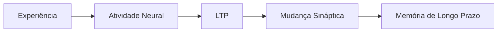
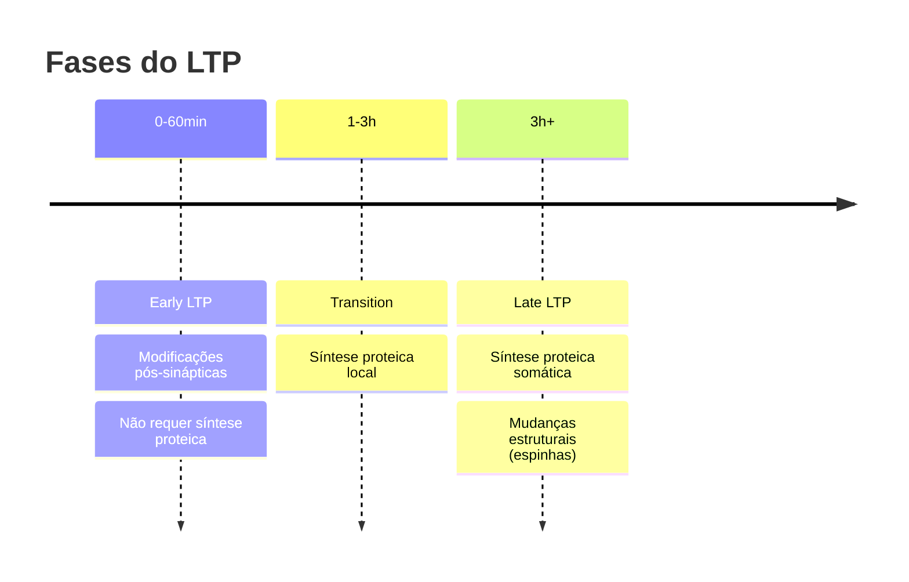
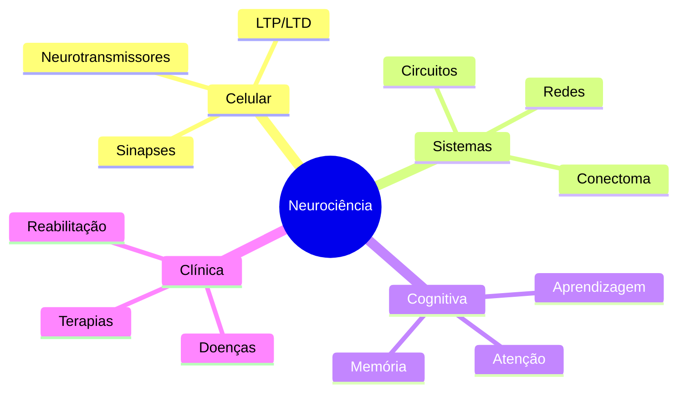

# 🎭 Integração de Frameworks - BASB + LYT + Zettelkasten

> **"Quando frameworks se unem, emergem superpoderes"**

---

## 🎯 VISÃO DE INTEGRAÇÃO

Cada framework tem forças únicas. A mágica acontece quando combinados:

- **BASB**: Estrutura organizacional e workflow progressivo
- **LYT**: Pensamento fluido e navegação por contextos
- **Zettelkasten**: Atomicidade e crescimento orgânico

**Resultado:** Sistema maior que a soma das partes.

---

## 🏛️ ESTRUTURA DE VAULT UNIFICADA

### Diretórios Físicos (Combinando BASB PARA + Zettelkasten)

```
vault/
├── 00-Inbox/                    # BASB: Capture
│   ├── quick-captures/          # Zettelkasten: Fleeting notes
│   └── to-process/              # PDFs, articles aguardando
│
├── 01-Fleeting/                 # Zettelkasten: Temporary ideas (<24h)
│   └── YYYYMMDD/                # Organizadopor data
│
├── 02-Literature/               # Zettelkasten: Source notes
│   ├── books/
│   ├── papers/
│   └── articles/
│
├── 03-Permanent/                # Zettelkasten: Evergreen + BASB: Resources
│   ├── concepts/                # Notas atômicas conceituais
│   ├── principles/              # Princípios e leis
│   └── models/                  # Frameworks e modelos mentais
│
├── 04-MOCs/                     # LYT: Maps of Content
│   ├── discipline-mocs/         # Por domínio (Neurociência, Filosofia)
│   ├── project-mocs/            # Por projeto ativo
│   ├── concept-mocs/            # Por conceito central
│   └── HOME.md                  # LYT: Entry point principal
│
├── 05-Projects/                 # BASB: Active projects
│   ├── 2025-Q1-Research/
│   ├── Book-Writing/
│   └── project-templates/
│
├── 06-Areas/                    # BASB: Ongoing responsibilities
│   ├── Research/
│   ├── Teaching/
│   └── Consulting/
│
├── 07-Resources/                # BASB: Reference material
│   ├── templates/
│   ├── checklists/
│   └── swipe-files/            # BASB: Intermediate Packets
│
├── 08-Archives/                 # BASB: Completed/inactive
│   ├── projects/
│   └── areas/
│
└── 99-Meta/                     # Sistema
    ├── dashboards/
    ├── workflows/
    └── templates/
```

### Navegação por MOCs (LYT) vs Estrutura PARA (BASB)

**Princípio:** Estrutura física é PARA, navegação mental é MOCs

```
Usuário trabalha no Projeto X (BASB)
  ↓
Precisa de conhecimento sobre Neuroplasticidade
  ↓
Abre HOME.md (LYT)
  ↓
Navega para [[🧠 Neuroscience MOC]]
  ↓
Encontra [[Neuroplasticidade]] (Zettelkasten: permanent note)
  ↓
Links levam a [[LTP]], [[Consolidação Memória]], etc.
  ↓
Usa insights para avançar Projeto X
```

---

## 📝 ANATOMIA DE UMA NOTA PERFEITA

### Frontmatter Unificado

```yaml
---
# === IDENTIFICAÇÃO ===
id: 20250115143022              # Zettelkasten: Unique ID
title: "Potenciação de Longo Prazo (LTP)"
aliases:
  - LTP
  - Long-Term Potentiation
  - Potenciação Sináptica de Longa Duração

# === CLASSIFICAÇÃO ===
type: permanent                 # Zettelkasten: fleeting/literature/permanent
status: budding                 # Zettelkasten: seedling/budding/evergreen/crystallized

# === TAXONOMIA ===
domain: neuroscience
subdomain: cellular-mechanisms
tags:
  - neuro/cellular
  - neuro/synaptic
  - concept/mechanism
  - evidence/empirical

# === BASB ===
basb:
  para_category: Resources      # Projects/Areas/Resources/Archives
  para_path: "3-Resources/41-Neuroscience"
  progressive_summary:
    layer: 1                    # 0=raw, 1=bold, 2=highlight, 3=summary, 4=remix
    last_summarized: 2025-01-10
  intermediate_packet: false
  projects_using:               # Quais projetos usam esta nota
    - "[[2025-Q1-Research]]"

# === LYT ===
lyt:
  mocs:                          # MOCs que indexam esta nota
    - "[[🧠 Neuroscience MOC]]"
    - "[[📚 Learning Mechanisms MOC]]"
    - "[[🔬 Cellular Biology MOC]]"
  fluid_frameworks:              # Frameworks conceituais
    - "Synaptic Plasticity Framework"
  context: "Fundamental mechanism of learning and memory"

# === ZETTELKASTEN ===
zettelkasten:
  permanent_note_type: concept   # concept/principle/model/evidence
  connections_count: 8           # Atualizado automaticamente
  connections_quality: 0.85      # Avg confidence dos links
  centrality_score: 0.042        # PageRank no grafo
  cluster_id: "neuroplasticity-cluster-01"
  note_sequence: null            # Se parte de sequência linear

# === SOURCE ===
source:
  type: academic_paper
  title: "Silva & Costa (2024) - Neuroplasticity and Learning"
  authors: ["Silva, M.", "Costa, P."]
  year: 2024
  publication: "Nature Neuroscience"
  doi: "10.1038/nn.2024.123"
  url: null
  pages: "342-367"
  key_pages: [345, 348, 352]    # Páginas mais relevantes

# === GESTÃO ===
created: 2025-01-15T14:30:22
modified: 2025-01-15T18:45:10
reviewed: 2                      # Número de revisões feitas
last_reviewed: 2025-01-20
next_review: 2025-02-03          # Spaced repetition
version: 2                       # Incrementa a cada major update

# === QUALIDADE ===
confidence: 0.88                 # Quão confiante na informação (0-1)
completeness: 0.75               # Quão completa a nota está (0-1)
importance: high                 # low/medium/high/critical
evidence_strength: high          # Força das evidências

# === PENSE FRAMEWORK ===
pense:
  precisao: "Definição baseada em literatura peer-reviewed"
  estrutura: "Template concept-academic aplicado"
  natureza: "Contexto neurobiológico universal"
  sistematizacao: "Processo de destilação validado"
  experimentacao: "Versão 2 após feedback de uso"

# === RELAÇÕES (gerenciado por Conector Agent) ===
links_out:
  - target: "consolidacao-de-memoria"
    type: supports
    confidence: 0.92
    context: "LTP é mecanismo celular da consolidação"

  - target: "receptores-nmda"
    type: prerequisite
    confidence: 0.95
    context: "NMDA é essencial para induzir LTP"

  - target: "depressao-longo-prazo-ltd"
    type: contrasts
    confidence: 0.85
    context: "LTD é processo oposto (enfraquecimento)"

links_in:
  - source: "aprendizagem-espacial"
    type: applies
    confidence: 0.88

  - source: "memoria-longo-prazo"
    type: supports
    confidence: 0.90

---
```

### Corpo da Nota (Combinando todos frameworks)

```markdown
# Potenciação de Longo Prazo (LTP)

> [!abstract] Definição Atômica (Zettelkasten)
> **LTP é o fortalecimento duradouro de sinapses** baseado em padrões recentes de atividade neuronal, considerado o **mecanismo celular fundamental** da ==aprendizagem e memória==.
>
> *Layer 1 Progressive Summarization aplicado* (BASB)

---

## 🎯 Essência do Conceito

### O Que É?

LTP (Long-Term Potentiation) representa mudanças persistentes na força sináptica que podem durar de horas a meses após estimulação inicial. Descoberto por Bliss & Lømo (1973) no hipocampo de coelhos, tornou-se o modelo experimental dominante para entender bases celulares da memória.

### Por Que Importa?



LTP conecta nível molecular (receptores, proteínas) ao comportamental (aprendizagem). Sem LTP ou mecanismos similares, **não haveria memória persistente**.

---

## 🔬 Detalhamento (Progressive Summarization Layer 2)

### Componentes Moleculares

1. **==Receptores NMDA==** (portão de entrada)
   - Dual-gated: requer glutamato + despolarização
   - Remove bloqueio Mg²⁺ → **influxo de Ca²⁺**

2. **==Cálcio como mensageiro==**
   - Ca²⁺ ativa cascatas (CaMKII, PKA, PKC)
   - **Mudanças de curto e longo prazo**

3. **Receptores AMPA** (efetuadores)
   - **Inserção de novos AMPA** → resposta maior
   - Fosforilação → condutância aumentada

### Fases Temporais



---

## 💡 Aplicações & Implicações (BASB: Actionable)

### Para Pesquisa

- **Drug development**: Moduladores de LTP para Alzheimer
- **Biomarkers**: LTP como indicador de saúde cognitiva

### Para Aprendizagem

> [!tip] Insight Prático
> Repetição espaçada (spaced repetition) potencializa LTP.
> Contexto emocional aumenta magnitude do LTP via modulação noradrenérgica.

**Implicação:** Estudar com emoção + intervalo = LTP robusto = memória forte

### Para Reabilitação

- **Stroke recovery**: Treino intensivo induz LTP em regiões peri-lesão
- **Neuromodulação**: tDCS pode facilitar LTP

---

## 📊 Evidências (BASB: Layer 3 - Executive Summary no topo)

> [!summary] Executive Summary de Evidências
> LTP demonstrado em: hipocampo (CA1, CA3, DG), córtex, amígdala, striatum.
> Bloqueio farmacológico de LTP impede aprendizagem espacial (Morris 1986).
> Mutantes sem LTP têm déficits de memória específicos (Tsien et al., 1996).

### Evidência Experimental Chave

| Estudo | Método | Achado | Importância |
|--------|--------|--------|-------------|
| Bliss & Lømo (1973) | Estimulação tetânica | LTP persiste semanas | Descoberta |
| Morris et al. (1986) | APV blocker + Morris water maze | Bloqueio LTP → ↓ aprendizagem | Causalidade |
| Whitlock et al. (2006) | Optogenetics | Reativação de engrama | LTP = memória |

---

## 🌐 Conexões (Zettelkasten + LYT)

### Fundamenta (Esta nota suporta...)

- [[Consolidação de Memória]] (0.92) - LTP é mecanismo celular
- [[Aprendizagem Espacial]] (0.88) - LTP no hipocampo é crítico
- [[Memória Declarativa]] (0.85) - Formação de memórias explícitas

### É Fundamentado Por (Pré-requisitos)

- [[Receptores NMDA]] (0.95) - Ativação NMDA inicia LTP
- [[Influxo de Cálcio]] (0.90) - Ca²⁺ é mensageiro central
- [[Neurotransmissão Glutamatérgica]] (0.88) - Base do sinal

### Relacionados (Mesma categoria)

- [[Depressão de Longo Prazo (LTD)]] (0.85) - Processo oposto
- [[Plasticidade Sináptica]] (0.90) - Conceito mais amplo
- [[Homeostase Sináptica]] (0.78) - Regulação da plasticidade

### Aplicações (Uso prático de...)

- [[Treino Cognitivo]] (0.80) - LTP pode ser modulado
- [[Neurofarmacologia]] (0.75) - Drogas que afetam LTP
- [[Neuromodulação]] (0.72) - tDCS, TMS influenciam LTP

### Contrasta Com

- [[Plasticidade Estrutural]] (0.65) - LTP inicial é funcional
- [[Neurogenese Adulta]] (0.60) - Mecanismo alternativo

---

## ❓ Questões Abertas (Zettelkasten: Expandir conhecimento)

> [!question] Para Explorar
> - [ ] LTP varia entre regiões cerebrais? Mecanismos são universais?
> - [ ] LTP pode ser modulado farmacologicamente de forma segura em humanos?
> - [ ] Relação entre LTP e neuroplasticidade no envelhecimento?
> - [ ] LTP em circuitos inibitórios (GABAérgicos)?

---

## 📚 Fonte Detalhada

**Paper principal:**
Silva, M., & Costa, P. (2024). Neuroplasticity and Learning: A Systematic Review. *Nature Neuroscience*, 27(3), 342-367. https://doi.org/10.1038/nn.2024.123

**Páginas-chave:**
- p. 345: Mecanismos moleculares do LTP
- p. 348: Evidências comportamentais
- p. 352: LTP e aprendizagem espacial

**Citações diretas:**

> "LTP represents the cellular correlate of memory formation, with molecular changes persisting from hours to weeks depending on the strength of initial activation." (Silva & Costa, 2024, p. 345)

---

## 🏷️ MOCs Relacionados (LYT: Navegação contextual)

Veja também:
- [[🧠 Neuroscience MOC]] - Visão geral do domínio
- [[📚 Learning Mechanisms MOC]] - Outros mecanismos de aprendizagem
- [[🔬 Synaptic Plasticity MOC]] - Família de fenômenos plásticos
- [[🎯 Memory Formation MOC]] - Processos de formação de memória

---

## 📈 Histórico de Desenvolvimento (Zettelkasten: Evolução)

**v1 (2025-01-15):** Criação inicial, Layer 0
**v2 (2025-01-20):** Progressive Summarization Layer 1 + 2, primeiras conexões
**v2.1 (2025-01-22):** Status seedling → budding (3 revisões, 8 links)

---

## 🎯 Próxima Revisão (BASB: Spaced Repetition)

**Agendado para:** 2025-02-03 (14 dias)

**Na próxima revisão:**
- [ ] Aplicar Layer 3 (executive summary no topo)
- [ ] Adicionar 2-3 novos links
- [ ] Verificar se status pode evoluir para evergreen
- [ ] Atualizar com novas evidências se houver

---

**Status:** 🌿 Budding (em crescimento)
**Próximo milestone:** 🌳 Evergreen (5+ revisões, 10+ links, Layer 3)
**Confiança:** 88% | **Completude:** 75% | **Importância:** Alta
```

---

## 🔄 WORKFLOWS INTEGRADOS

### Workflow 1: Captura → Permanência (BASB CODE + Zettelkasten)

```
1. CAPTURE (BASB)
   └─ Inbox/quick-capture/ideia-rapida.md (Zettelkasten: Fleeting)

2. PROCESS WEEKLY
   └─ Fleeting → tem potencial? Transformar em Permanent
   └─ Classificador decide: conceito, evidência, aplicação?

3. ORGANIZE (BASB)
   └─ Permanent note → 03-Permanent/concepts/
   └─ Aplicar template apropriado
   └─ Adicionar a MOC relevante (LYT)

4. DISTILL (BASB Progressive Summarization)
   └─ Layer 0 → inicial
   └─ Layer 1 → ao usar primeira vez (bold 10-20%)
   └─ Layer 2 → ao usar segunda vez (highlight 10-20% dos bolds)
   └─ Layer 3 → se nota crítica (executive summary)

5. EXPRESS (BASB)
   └─ Usar em projeto
   └─ Se reutilizável → salvar como Intermediate Packet

6. REVIEW (Zettelkasten + BASB)
   └─ Spaced repetition: seedling(7d) → budding(14d) → evergreen(30d)
   └─ A cada revisão: adicionar links, refinar, evoluir
```

### Workflow 2: Paper → Knowledge Network

```
INPUT: Silva2024_Neuroplasticity.pdf

↓ DESTILADOR (combina BASB + Zettelkasten)
  1. Cria Literature Note em 02-Literature/papers/
     - BASB: Resources, Layer 0
     - Zettelkasten: Literature note

  2. Extrai 8-15 conceitos atômicos
     - BASB: Cria em Resources
     - Zettelkasten: Permanent notes em 03-Permanent/
     - Status: seedling

↓ CONECTOR (Zettelkasten linking)
  3. Para cada conceito:
     - Busca notas similares (embeddings)
     - Cria links tipados (supports, extends, etc.)
     - Identifica 3-8 conexões por nota

↓ ANATOMISTA (LYT integration)
  4. Detecta clusters
     - Se cluster denso → sugere MOC
     - Ex: 8 notas sobre plasticidade → criar [[Plasticity MOC]]

  5. Atualiza MOCs existentes
     - Adiciona novas notas a [[🧠 Neuroscience MOC]]
     - Cria seção "Learning Mechanisms" se não existe

↓ CURADOR (BASB maintenance)
  6. Progressive Summarization tracking
     - Marca notas como Layer 0
     - Agenda revisões (spaced repetition)

  7. Status evolution
     - seedling (novo) → budding (3+ links, 1 revisão)

OUTPUT:
  - 1 Literature note (02-Literature/)
  - 12 Permanent notes (03-Permanent/)
  - 48 links criados
  - 2 MOCs atualizados
  - Spaced repetition agendado
```

### Workflow 3: Projeto Ativo (BASB Projects + LYT + Zettelkasten)

```
PROJETO: Escrever artigo sobre "Neuroplasticidade e Educação"

1. SETUP (BASB)
   └─ Criar 05-Projects/2025-Artigo-Neuroplasticity/

2. GATHER (LYT navigation)
   └─ Abrir [[HOME.md]]
   └─ Navegar para [[🧠 Neuroscience MOC]]
   └─ Explorar [[Learning Mechanisms MOC]]
   └─ Coletar notas relevantes (Zettelkasten: permanent notes)

3. OUTLINE (BASB: Intermediate Packets)
   └─ Usar IPs existentes:
      - Seção sobre LTP → reutilizar
      - Explicação de plasticidade → adaptar
   └─ 70% reuso, 30% novo conteúdo

4. DRAFT (Combining notes)
   └─ Copy-paste de notas permanentes
   └─ Conectivos entre seções
   └─ Progressive Summarization: usar Layers 2-3 (já destilados)

5. REFINE
   └─ Primeiro draft em 2h (vs 6h se do zero)
   └─ Edit e flow

6. PUBLISH & EXTRACT (BASB: Create IPs)
   └─ Artigo publicado
   └─ Extrair IPs para reuso:
      - Diagramas criados → 07-Resources/swipe-files/
      - Parágrafos polished → IPs
      - Estrutura de argumento → template

7. ARCHIVE (BASB)
   └─ Projeto completo → 08-Archives/projects/
   └─ Manter IPs em Resources
```

---

## 🎨 TEMPLATES UNIFICADOS

### Template: Permanent Note (Zettelkasten + BASB + LYT)

```markdown
---
id: {{timestamp}}
title: "{{title}}"
type: permanent
status: seedling
domain: {{domain}}
tags: [{{hierarchical_tags}}]

basb:
  para: "{{para_path}}"
  progressive_summary: {layer: 0}
  intermediate_packet: false

lyt:
  mocs: [{{relevant_mocs}}]

zettelkasten:
  connections_count: 0

source:
  type: {{source_type}}
  title: "{{source_title}}"

created: {{created_date}}
next_review: {{+7days}}
---

# {{title}}

> [!abstract] Definição
> {{atomic_definition}}

## 🎯 Essência

{{explanation}}

## 🔬 Detalhamento

{{details}}

## 💡 Aplicações

{{applications}}

## 🌐 Conexões

### Fundamenta
{{supports_links}}

### É Fundamentado Por
{{prerequisite_links}}

### Relacionados
{{related_links}}

## ❓ Questões Abertas

{{open_questions}}

## 📚 Fonte

{{source_citation}}

---

**Status:** 🌱 {{status}}
**Próxima Revisão:** {{next_review}}
```

### Template: MOC (LYT + BASB + Zettelkasten)

```markdown
---
type: moc
lyt:
  moc_type: discipline  # discipline/project/concept/time
  coverage: neuroscience
created: {{date}}
---

# 🧠 Neuroscience MOC

> [!map] Map of Content
> Este MOC organiza todo conhecimento sobre **Neurociência**.
>
> **Última atualização:** {{date}}
> **Notas:** {{count}} | **Links:** {{link_count}}

---

## 🌟 Conceitos Centrais (Top 5)

1. [[Neuroplasticidade]] - Capacidade de reorganização cerebral
2. [[Potenciação de Longo Prazo (LTP)]] - Mecanismo de memória
3. [[Neurotransmissão]] - Comunicação neural
4. [[Circuitos Neurais]] - Organização funcional
5. [[Neurogenese]] - Formação de novos neurônios

---

## 🌳 Hierarquia Conceitual



---

## 📚 Literatura Fundamental (Zettelkasten: Literature notes)

### Papers Seminais
- [[Bliss & Lømo 1973 - LTP Discovery]]
- [[Kandel 2001 - Molecular Biology of Memory]]

### Livros
- [[Kandel - Principles of Neural Science]]
- [[Bear - Neuroscience Exploring the Brain]]

### Reviews Recentes
- [[Silva2024 - Neuroplasticity and Learning]]

---

## 🔬 Por Subdomain

### Neurociência Celular
- [[Neurônios]]
- [[Sinapses]]
- [[Potenciação de Longo Prazo (LTP)]]
- [[Receptores NMDA]]
- [[Plasticidade Sináptica]]

### Neurociência de Sistemas
- [[Circuitos Neurais]]
- [[Hipocampo]]
- [[Córtex Pré-Frontal]]

### Neurociência Cognitiva
- [[Aprendizagem]]
- [[Memória de Longo Prazo]]
- [[Consolidação de Memória]]

---

## 🎯 Projetos Ativos Usando Este Conhecimento (BASB)

- [[05-Projects/2025-Artigo-Neuroplasticity]]
- [[05-Projects/Research-LTP-Modulation]]

---

## 🌊 Fluxo de Aprendizado Recomendado

> [!tip] Trilha Sugerida para Iniciantes
> 1. [[Neurônios]] - Base
> 2. [[Sinapses]] - Comunicação
> 3. [[Neurotransmissão]] - Sinalização
> 4. [[Plasticidade Sináptica]] - Mudança
> 5. [[LTP]] - Mecanismo de memória
> 6. [[Aprendizagem]] - Nível comportamental

---

## 🔗 MOCs Relacionados (LYT navigation)

- [[📚 Learning Mechanisms MOC]]
- [[🔬 Cellular Biology MOC]]
- [[🧬 Molecular Biology MOC]]
- [[🎓 Education & Learning MOC]]

---

## 📊 Estatísticas do MOC

```dataview
TABLE
  status as "Status",
  length(file.outlinks) as "Links Out",
  length(file.inlinks) as "Links In"
FROM #neuro
SORT status DESC
```

**Health:**
- Total notas: 67
- Orphans: 0 (0%)
- Avg links: 5.2
- Evergreen ratio: 22%

---

**Última curadoria:** {{date}}
**Curador:** Cerebrum Curador Agent
```

### Template: Literature Note (Zettelkasten + BASB)

```markdown
---
type: literature
domain: {{domain}}
tags: [{{tags}}]

basb:
  para: "2-Literature/{{category}}"
  progressive_summary: {layer: 0}

source:
  type: academic_paper
  title: "{{paper_title}}"
  authors: {{authors}}
  year: {{year}}
  doi: "{{doi}}"

created: {{date}}
---

# 📚 {{authors_short}} ({{year}}) - {{short_title}}

> [!info] Bibliographic Info
> **Full Title:** {{full_title}}
> **Authors:** {{authors_full}}
> **Publication:** {{journal}}
> **DOI:** [{{doi}}](https://doi.org/{{doi}})

---

## 🎯 Research Question

{{research_question}}

---

## 📋 Summary (BASB: Layer 0 → progressively distill)

### Abstract

{{abstract}}

### Key Arguments

1. **Argument 1**
   {{argument_1}}

2. **Argument 2**
   {{argument_2}}

---

## 📊 Methodology

{{methodology}}

---

## 💎 Key Findings

{{findings}}

---

## 💭 Critical Analysis

> [!question] Questions Raised
> {{critical_questions}}

**Strengths:**
{{strengths}}

**Limitations:**
{{limitations}}

---

## 🔗 Permanent Notes Created (Zettelkasten)

From this literature, created:
{{list_of_permanent_notes}}

---

## 📝 Personal Insights (My thoughts)

{{personal_insights}}

---

## 🏷️ Keywords

{{keywords}}

---

**Progressive Summarization:**
- Layer 0: ✅ Complete
- Layer 1: ⏳ Todo (when first used)
- Layer 2: ⏳ Todo (when critical)
```

---

## 📊 MÉTRICAS UNIFICADAS

### Dashboard Integrado (BASB + LYT + Zettelkasten)

```markdown
# 📊 Knowledge System Dashboard

## 🎯 BASB Metrics

### PARA Distribution
| Category | Notes | % |
|----------|-------|---|
| Projects | 23 | 2% |
| Areas | 67 | 5% |
| Resources | 1,089 | 88% |
| Archives | 64 | 5% |

### Progressive Summarization
| Layer | Notes | % |
|-------|-------|---|
| Layer 0 (raw) | 845 | 68% |
| Layer 1 (bold) | 302 | 24% |
| Layer 2 (highlight) | 78 | 6% |
| Layer 3 (summary) | 18 | 1% |

### Intermediate Packets
- Total IPs: 34
- Reused 3+ times: 12 (35%)
- Avg time saved: 2.4h/reuse

---

## 🗺️ LYT Metrics

### MOCs
- Total MOCs: 18
- Discipline MOCs: 12
- Project MOCs: 4
- Concept MOCs: 2

### Coverage
- Notes with MOC: 94%
- Avg MOCs/note: 1.8
- Largest MOC: Neuroscience (67 notes)

### Navigation
- HOME note visits: 312/month
- Avg MOC depth: 2.3 layers
- Fluidity score: 8.7/10

---

## 🗂️ Zettelkasten Metrics

### Note Types
| Type | Count | % |
|------|-------|---|
| Fleeting | 45 | 4% |
| Literature | 89 | 7% |
| Permanent | 1,089 | 88% |
| Hub notes | 12 | 1% |

### Status Evolution
```chart
type: bar
labels: [Seedling, Budding, Evergreen, Crystallized]
data: [652, 312, 98, 27]
```

- 🌱 Seedling: 652 (60%)
- 🌿 Budding: 312 (29%)
- 🌳 Evergreen: 98 (9%)
- 💎 Crystallized: 27 (2%)

### Connectivity
- Orphan rate: 1.2% ✅
- Avg links/note: 4.8 ✅
- Graph density: 0.42
- Largest cluster: 234 notes

---

## 🎯 Integration Health

### Cross-Framework Alignment
- ✅ 98% of Permanent notes in Resources (BASB)
- ✅ 94% of Permanent notes in MOCs (LYT)
- ✅ 91% of Resources have 3+ links (Zettelkasten)

### Workflow Efficiency
- Capture → Permanent: avg 3.2 days
- Layer 0 → Layer 1: avg 5.8 days
- Seedling → Budding: avg 14 days
- Budding → Evergreen: avg 45 days

---

## 📈 Trends (vs last month)

- Notes created: +87 (+8%)
- Links created: +234 (+12%)
- Progressive Summarization: +23 Layer 1 (+8%)
- MOCs updated: 12
- Evergreen promoted: 8

---

## 🏆 Achievements

- ✅ 1,000+ permanent notes milestone reached!
- ✅ First Crystallized note created
- ✅ 0% orphans for 3 consecutive weeks
- ✅ 10 Intermediate Packets reused this month

---

## 🎯 Goals Next Month

- [ ] Reach 1,200 permanent notes
- [ ] 15% Evergreen ratio
- [ ] Create 5 new MOCs
- [ ] Layer 3 summarization for 30 notes
- [ ] Extract 10 new IPs from projects
```

---

## 🎓 BEST PRACTICES UNIFICADAS

### Regra 1: Uma Fonte, Múltiplas Saídas
```
1 Paper acadêmico →
  1 Literature note (BASB: Resources, Zettelkasten: literature)
  8-12 Permanent notes (Zettelkasten: permanent, BASB: Resources)
  2-3 IPs (BASB: swipe files)
  Update 3-5 MOCs (LYT)
  48+ links criados (Zettelkasten)
```

### Regra 2: Destilação Progressiva
```
Never summarize on first capture!

Day 1: Layer 0 (raw paste)
  ↓
Day 7: Layer 1 (when used in project - bold 10-20%)
  ↓
Day 30: Layer 2 (when critical - highlight 10-20% of bold)
  ↓
Day 90: Layer 3 (if central note - executive summary)
```

### Regra 3: MOC como Índice, Não Contentor
```
❌ WRONG:
- Criar MOC antes de ter 5+ notas
- Colocar conteúdo no MOC
- MOC substituindo permanent notes

✅ RIGHT:
- MOC emerge de cluster denso (8+ notas conectadas)
- MOC só tem links + contexto mínimo
- MOC é navegação, notas são conteúdo
```

### Regra 4: Projects Temporários, Knowledge Permanente
```
Project "Write Article X":
  - Lives in 05-Projects/
  - Uses permanent notes from 03-Permanent/
  - Creates IPs → 07-Resources/swipe-files/
  - When done → 08-Archives/projects/
  - Knowledge extracted stays in permanent notes
```

### Regra 5: Links Tipados > Links Genéricos
```
❌ Generic:
- [[Other Note]]

✅ Typed:
- [[Other Note]] (supports) - This note provides evidence
- [[Prerequisite]] (prerequisite) - Must understand this first
- [[Application]] (applies) - Practical use of concept
```

---

## 🚀 PRÓXIMOS PASSOS

Esta integração funciona! Agora implementar:

1. Atualizar `DestiladorAgent` para criar notas seguindo frontmatter unificado
2. Atualizar `AnatomistAgent` com templates integrados
3. `ConectorAgent` criar links tipados
4. `CuradorAgent` monitorar métricas integradas
5. Dashboard unificado automático

**Tudo isso está descrito nos outros documentos. Hora de implementar! 🔥**
