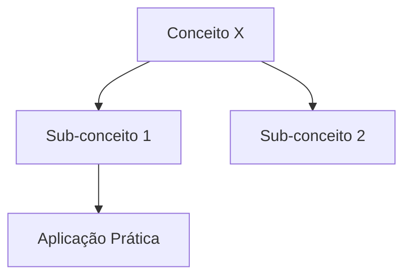
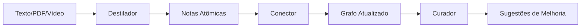
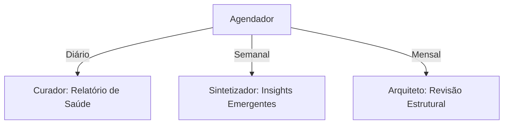
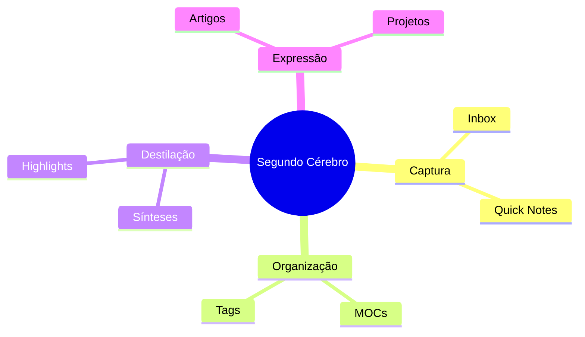

# 🧠 Visão: Sistema Multi-Agentes de Refinaria de Conhecimento

## 🎯 Conceito Central: "Cerebrum" - Sua Refinaria Cognitiva

Transformar o Obsidian-atomizer em um **ecossistema inteligente de agentes especializados** que gerenciam, refinam e evoluem seu conhecimento de forma escalável e contínua.

---

## 🤖 Arquitetura Multi-Agentes

### **1. ARQUITETO (Architect Agent)**
**Responsabilidade:** Planejamento estrutural e design do vault

**Capabilities:**
- Analisa estrutura atual do vault ou cria do zero
- Propõe taxonomias inteligentes (MOCs, folders, tags)
- Sugere templates personalizados baseados no domínio
- Cria "blueprints" de conhecimento (Canvas maps)
- Define convenções de naming e linking

**Input:** Vault existente ou descrição de domínio
**Output:** Estrutura completa + guia de implementação

**Exemplo de Fluxo:**
```
Usuário: "Estou estudando Neurociência e Filosofia"
Arquiteto:
  ✓ Cria MOCs: [[🧠 Neurociência Hub]], [[🤔 Filosofia Hub]]
  ✓ Define namespaces: neuro/cognicao, filosofia/epistemologia
  ✓ Gera templates: Experimento.md, Conceito-Filosofico.md
  ✓ Configura tags hierárquicas
```

---

### **2. DESTILADOR (Distiller Agent)**
**Responsabilidade:** Extração e atomização de conhecimento

**Capabilities:**
- Análise semântica profunda (NLP avançado)
- Decomposição em notas atômicas com múltiplos níveis
- Identificação de: conceitos, princípios, evidências, aplicações, questões
- Extração de metadados ricos (autores, datas, fontes)
- Criação de progressive summarization layers

**Output Avançado:**
- Notas literais (direct quotes)
- Notas interpretativas (your understanding)
- Notas de síntese (connections)
- Notas de aplicação (practical use)

**Markdown Avançado Explorado:**
```markdown
---
type: concept-note
status: seedling → budding → evergreen
confidence: 0.85
last_reviewed: 2025-01-15
review_interval: 14d
---

# Conceito X

> [!abstract] Definição Canônica
> Texto destilado ultra-preciso

> [!question] Questões Abertas
> - [ ] Como isso se relaciona com Y?
> - [ ] Aplicação no contexto Z?

## 🔍 Camadas de Compreensão

> [!tip]- Layer 1: Essência (click to expand)
> Resumo de 1 frase

> [!note]- Layer 2: Contexto
> Parágrafo explicativo

> [!example]- Layer 3: Evidências
> Dados, citações, casos

## 📊 Visualização

```dataview
TABLE status, confidence, last_reviewed
FROM #conceito
WHERE relates-to = [[Conceito X]]
```

## 🌐 Mapa Conceitual


```

---

### **3. CONECTOR (Linker Agent)**
**Responsabilidade:** Criação de conexões semânticas inteligentes

**Capabilities:**
- Análise de grafos de conhecimento
- Sugestão de backlinks contextuais (não só similaridade TF-IDF)
- Identificação de "knowledge gaps" (missing links)
- Detecção de conceitos emergentes
- Criação de MOCs dinâmicos

**Técnicas:**
- Knowledge Graph Embeddings
- Semantic Similarity (BERT/Sentence Transformers)
- Análise de centralidade (PageRank aplicado ao vault)
- Clusterização temática

**Output:**
```markdown
## 🔗 Conexões Inteligentes

### Relações Diretas
- [[Conceito Y]] → causa-efeito
- [[Teoria Z]] → fundamenta

### Relações Emergentes (sugeridas pela IA)
- [[Padrão A]] → analogia estrutural (87% similaridade)
- [[Aplicação B]] → potencial uso prático

### Lacunas Detectadas
> [!warning] Knowledge Gap
> Falta conexão entre [[X]] e [[Y]].
> Sugestão: criar nota "X aplicado a Y"
```

---

### **4. CURADOR (Curator Agent)**
**Responsabilidade:** Manutenção e evolução contínua do vault

**Capabilities:**
- Identifica notas órfãs (sem links)
- Detecta duplicações e redundâncias
- Sugere merge de notas similares
- Atualiza status (seedling → evergreen)
- Agenda revisões espaçadas (spaced repetition)
- Cria relatórios de "saúde do conhecimento"

**Sistema de Estágios de Maturação:**
```markdown
🌱 Seedling (nova, raw)
🌿 Budding (processada, 1+ conexão)
🌳 Evergreen (madura, 5+ conexões, revisada 3x)
💎 Crystallized (nota-chave, alta centralidade)
```

**Dashboard Gerado:**
```markdown
# 📊 Knowledge Health Dashboard

## Estatísticas
- Total de notas: 342
- Notas evergreen: 89 (26%)
- Notas órfãs: 12 ⚠️
- Densidade de conexões: 4.2 links/nota
- Conhecimento não revisado (>30d): 45 notas

## 🎯 Ações Recomendadas
1. [ ] Revisar [[Nota X]] (120 dias sem revisão)
2. [ ] Conectar [[Nota Y]] (órfã)
3. [ ] Mesclar [[A]] e [[B]] (85% similares)

## 📈 Crescimento Semanal
```chart
type: line
data: [12, 15, 18, 22, 19, 21, 25]
```
```

---

### **5. SINTETIZADOR (Synthesizer Agent)**
**Responsabilidade:** Criação de conhecimento emergente

**Capabilities:**
- Gera insights cross-domain
- Cria MOCs temáticos automaticamente
- Produz "literature notes" de múltiplas fontes
- Gera artigos/ensaios a partir do vault
- Identifica padrões não óbvios

**Exemplo:**
```markdown
# 🔮 Síntese Emergente: Padrão X em 3 Domínios

> [!insight] Descoberta
> Analisando seu vault, identifiquei o mesmo padrão
> estrutural em [[Neuroplasticidade]], [[Sistemas Adaptativos]]
> e [[Metodologias Ágeis]].

## Padrão Unificador
1. Feedback loops
2. Adaptação incremental
3. Robustez por diversidade

## Nova Nota Sugerida
[[Meta-Padrão de Adaptação Evolutiva]]
```

---

### **6. PROFESSOR (Teacher Agent)**
**Responsabilidade:** Extração de aprendizado e criação de conteúdo educacional

**Capabilities:**
- Converte notas em flashcards (Anki/Spaced Repetition)
- Gera quizzes e exercícios
- Cria progressive learning paths
- Identifica pré-requisitos de conhecimento
- Produz explicações em múltiplos níveis (ELI5 → Expert)

**Output:**
```markdown
# 📚 Learning Path: Neurociência Cognitiva

## Pré-requisitos
- [ ] [[Anatomia do Cérebro]] (básico)
- [ ] [[Sinapse Neural]] (intermediário)

## Trilha Recomendada
1. [[Neurônios e Potencial de Ação]] (2h)
2. [[Neurotransmissores]] (1.5h)
3. [[Plasticidade Sináptica]] (3h)
4. [[Memória de Longo Prazo]] (2h)

## 🎴 Flashcards Gerados
**Q:** O que é plasticidade sináptica?
**A:** ...
```

---

### **7. TEMPLÁRIO (Templater Agent)**
**Responsabilidade:** Gestão inteligente de templates

**Capabilities:**
- Biblioteca de templates por domínio
- Templates dinâmicos (contextuais)
- Auto-preenchimento de metadados
- Wizards de criação guiada
- Versionamento de templates

**Tipos de Templates:**

**A. Templates Estruturais:**
- 📖 Literatura Note
- 🧪 Experimento/Projeto
- 💡 Ideia/Insight
- 📝 Meeting Note
- 🎯 Goal/OKR
- 🧩 Conceito/Definição
- 🔄 Processo/SOP

**B. Templates Contextuais:**
```javascript
// Template que se adapta ao contexto
if (notaRelacionadaA("pesquisa")) {
  incluir("seção de metodologia")
}
if (tags.includes("prático")) {
  incluir("checklist de implementação")
}
```

**C. Templates Guiados (Wizard):**
```
1. Que tipo de nota você quer criar?
   → [Conceito] [Projeto] [Literatura] [MOC]

2. [Se Conceito] Qual o domínio?
   → [Filosofia] [Ciência] [Negócios] [Arte]

3. [Auto-preenche]:
   - Tags sugeridas: #filosofia/epistemologia
   - MOC pai: [[🤔 Filosofia Hub]]
   - Template aplicado: Conceito-Filosofico.md
```

---

## 🔄 Orquestração dos Agentes

### **Fluxo 1: Ingestão de Novo Conhecimento**


### **Fluxo 2: Manutenção Contínua (Cron Jobs)**


### **Fluxo 3: Criação Assistida**
```mermaid
graph LR
    A[Usuário: "Criar Nota X"] --> B[Templário: Wizard]
    B --> C[Template Contextual]
    C --> D[Destilador: Enriquecimento]
    D --> E[Conector: Linking Automático]
    E --> F[Nota Final]
```

---

## 🎨 Recursos Markdown/Obsidian a Explorar

### **1. Callouts Avançados**
```markdown
> [!multi-column]
> > [!note]+ Coluna 1
> > Conteúdo
>
> > [!tip]+ Coluna 2
> > Conteúdo

> [!progress]+ Status de Aprendizado
> ```dataviewjs
> const nota = dv.current();
> const progress = nota.reviews / 5 * 100;
> dv.span(`**${progress}%** para status Evergreen`);
> ```
```

### **2. Dataview Queries Dinâmicas**
```dataview
TABLE
  status as "Status",
  length(file.outlinks) as "Conexões",
  confidence as "Confiança"
FROM #conceito
WHERE status != "evergreen"
SORT confidence DESC
LIMIT 10
```

### **3. Canvas para Mapas Visuais**
- Gerar automaticamente Canvas a partir de clusters
- Visualização de "knowledge islands"
- Mapas de argumentação

### **4. Metadata Avançada**
```yaml
---
type: concept
domain: [neuroscience, psychology]
complexity: intermediate
prerequisite: [[Neurônio]], [[Sinapse]]
related_projects: [[Projeto X]]
confidence: 0.82
evidence_strength: high
review_count: 3
next_review: 2025-02-01
tags:
  - neuro/cellular
  - evergreen
---
```

### **5. Embedded Queries**
```markdown
## Notas Relacionadas
```dataview
LIST
FROM [[]]
WHERE file.name != this.file.name
```
```

### **6. Mermaid Diagrams Complexos**


---

## 🏗️ Arquitetura Técnica Proposta

### **Stack Sugerido:**

**Backend (Python):**
- FastAPI (API multi-agente)
- LangChain/LangGraph (orquestração de agentes)
- ChromaDB/Pinecone (vector store para embeddings)
- Sentence Transformers (semantic similarity)
- NetworkX (análise de grafos)

**Frontend (TypeScript):**
- Manter React + Vite
- Adicionar: React Flow (visualização de grafos)
- Adicionar: Monaco Editor (edição avançada)

**IA:**
- Gemini 2.5 Pro (agentes principais)
- Gemini Flash (tarefas rápidas)
- Local embeddings (privacidade)

### **Arquitetura de Dados:**

```
Vault Structure:
├── 00-Inbox/          # Notas não processadas
├── 01-Fleeting/       # Ideias rápidas
├── 02-Literature/     # Notas de fontes
├── 03-Permanent/      # Notas evergreen
├── 04-MOCs/           # Maps of Content
├── 05-Projects/       # Notas de projeto
├── 06-Templates/      # Templates dinâmicos
└── 99-Meta/           # Dashboards, relatórios
    ├── health-report.md
    ├── knowledge-graph.canvas
    └── learning-paths/
```

---

## 🚀 Roadmap de Implementação

### **Fase 1: Foundation (MVP Multi-Agente)**
- [ ] Criar backend FastAPI com 3 agentes: Destilador, Conector, Templário
- [ ] Integrar LangGraph para orquestração
- [ ] Migrar atomização atual para o Destilador
- [ ] Implementar sistema de templates básico

### **Fase 2: Intelligence Layer**
- [ ] Adicionar Arquiteto (análise de estrutura)
- [ ] Adicionar Curador (manutenção)
- [ ] Implementar embeddings semânticos
- [ ] Sistema de confidence scores

### **Fase 3: Emergent Knowledge**
- [ ] Adicionar Sintetizador
- [ ] Adicionar Professor
- [ ] Graph analysis avançado
- [ ] MOCs automáticos

### **Fase 4: UX & Automation**
- [ ] Dashboard interativo
- [ ] Wizards de criação
- [ ] Cron jobs para manutenção
- [ ] Integração com Obsidian (plugin?)

---

## 💡 Diferenciais Competitivos

### **vs. Obsidian puro:**
- ✅ IA que entende seu domínio
- ✅ Manutenção proativa automática
- ✅ Insights emergentes cross-domain

### **vs. Notion AI:**
- ✅ Foco em Zettelkasten e pensamento conectivo
- ✅ Propriedade total dos dados (Markdown local)
- ✅ Personalização profunda (templates, taxonomias)

### **vs. Mem.ai / Reflect:**
- ✅ Multi-agentes especializados (não só busca semântica)
- ✅ Gestão escalável de vaults grandes (1000+ notas)
- ✅ Open-source e extensível

---

## 🎯 Casos de Uso

### **1. Pesquisador Acadêmico**
- Ingere PDFs e artigos
- Destilador extrai conceitos, metodologias, resultados
- Conector mapeia relações entre papers
- Sintetizador cria literature reviews

### **2. Empreendedor/Estrategista**
- Captura insights de reuniões, livros, cursos
- Curador mantém knowledge base atualizada
- Professor cria learning paths para time
- Arquiteto estrutura knowledge base por área (produto, vendas, tech)

### **3. Estudante/Aprendiz Perpétuo**
- Templates para diferentes tipos de estudo
- Flashcards automáticos
- Spaced repetition tracking
- Visualização de progresso

### **4. Criador de Conteúdo**
- Vault como "idea garden"
- Sintetizador gera outlines de artigos/vídeos
- Conexões entre ideias antigas geram conteúdo novo
- Dashboard de "ideias prontas para publicar"

---

## 🤔 Questões Arquiteturais para Discutir

1. **Modelo de Processamento:**
   - Batch (usuário clica "processar") vs. Real-time (automático)?
   - Hybrid approach?

2. **Privacidade:**
   - Processamento local (LLMs locais) vs. Cloud (Gemini)?
   - Opção de escolha?

3. **Integração com Obsidian:**
   - Standalone app que exporta para Obsidian?
   - Plugin nativo do Obsidian?
   - Web app que sincroniza via Git?

4. **Escalabilidade:**
   - Como lidar com vaults de 10,000+ notas?
   - Indexação incremental?
   - Caching de embeddings?

5. **Customização:**
   - Até que ponto permitir customização de agentes?
   - Sistema de "skills" para agentes?
   - Marketplace de templates/workflows?

---

## 🎨 Nome do Projeto (Ideias)

- **Cerebrum** (cérebro em latim)
- **Myelin** (revestimento neural → conhecimento refinado)
- **Dendrite** (ramificações neuronais → conhecimento conectado)
- **Synapse** (conexões → core do sistema)
- **Athenaeum** (biblioteca/templo do conhecimento)

---

## 📚 Próximos Passos

1. Validar visão com usuários potenciais
2. Prototipar arquitetura multi-agente básica
3. Criar demos de cada agente isolado
4. Definir formato de "vault contract" (estrutura esperada)
5. Desenvolver sistema de templates first

---

**Vamos discutir:**
- Qual agente priorizar primeiro?
- Modelo de monetização (freemium, open-core, SaaS)?
- Integração com outras ferramentas (Readwise, Zotero, etc.)?
