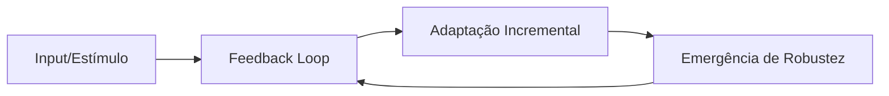

# 🏛️ CEREBRUM ULTIMATE - Refinaria Suprema de Conhecimento

> **"Do caos à harmonia: Um laboratório inteligente de conhecimento curado"**

---

## 🎯 A VISÃO SUPREMA

**VOCÊ JOGA:** Caos informacional (PDFs, artigos, notas soltas, ideias fragmentadas)

**SISTEMA RETORNA:** Conhecimento cristalino, perfeitamente organizado, densamente interconectado, pronto para uso, crescendo harmonicamente

### O Que Isso Significa?

Um **sistema multi-agente orquestrado** que combina os melhores frameworks de gestão de conhecimento:

- **BASB (Building a Second Brain)**: CODE + PARA + Progressive Summarization
- **LYT (Linking Your Thinking)**: MOCs + Fluid Frameworks
- **Zettelkasten**: Atomic notes + Evergreen thinking
- **PENSE Framework**: Metodologia d.IA.logo
- **PKM Best Practices**: Johnny Decimal, LIFT, etc.

**Resultado:** Um segundo cérebro que não apenas armazena, mas **pensa, conecta, evolui e cria** junto com você.

---

## 🧠 METÁFORA CENTRAL

### O Cerebrum é um **Laboratório Anatômico de Conhecimento**

Imagine um laboratório onde:

1. **Matéria-prima bruta** (PDFs, textos) entra
2. **Anatomistas especializados** (agentes) dissecam e analisam
3. **Processos químicos** (algoritmos) refinam e purificam
4. **Taxonomistas** etiquetam e classificam
5. **Conectores neurais** criam sinapses entre conceitos
6. **Curadores** mantêm saúde do sistema
7. **Sintetizadores** geram insights emergentes

**Output:** Conhecimento de grau farmacêutico, pronto para consumo cognitivo.

---

## 🏗️ ARQUITETURA DE INTEGRAÇÃO DOS FRAMEWORKS

### Camada 1: **BASB (Fundação Organizacional)**

**O que traz:**
- **PARA Structure**: Projects, Areas, Resources, Archives
- **CODE Workflow**: Capture, Organize, Distill, Express
- **Progressive Summarization**: Layers 0-4
- **Intermediate Packets**: Building blocks reutilizáveis

**Como integra:**
```
00-Inbox/           → CAPTURE (raw)
├─ 1-Projects/      → ORGANIZE (ativo)
├─ 2-Areas/         → ORGANIZE (contínuo)
├─ 3-Resources/     → ORGANIZE (referência)
└─ 4-Archives/      → ORGANIZE (inativo)

03-Permanent/       → DISTILL + EXPRESS (evergreen)
04-MOCs/            → EXPRESS (mapas)
05-IPs/             → EXPRESS (packets)
```

---

### Camada 2: **LYT (Estrutura de Pensamento)**

**O que traz:**
- **MOCs (Maps of Content)**: Índices dinâmicos temáticos
- **Fluid Frameworks**: Estruturas flexíveis não-hierárquicas
- **Home Note**: Ponto central de navegação
- **Emergence**: Estrutura emerge do uso

**Como integra:**
```
04-MOCs/
├─ 🏠 HOME.md                    ← Entry point
├─ 🧠 Neuroscience MOC.md
├─ 📚 Philosophy MOC.md
└─ 🔬 Research Methods MOC.md

Cada MOC:
- Agrupa notas relacionadas
- Cria narrativas temáticas
- Evolui organicamente
- Links bidirecionais automáticos
```

**Tipos de MOCs:**
1. **Discipline MOCs**: Por domínio (Neurociência, Filosofia)
2. **Project MOCs**: Por projeto ativo
3. **Concept MOCs**: Por conceito central (Plasticidade, Aprendizagem)
4. **Time MOCs**: Por período (2025-Q1 Learning)

---

### Camada 3: **Zettelkasten (Atomicidade e Conexões)**

**O que traz:**
- **Atomic Notes**: 1 conceito = 1 nota
- **Permanent Notes**: Pensamento evergreen
- **Literature Notes**: Captura de fontes
- **Fleeting Notes**: Ideias rápidas
- **Slip-box Method**: Conexões emergentes

**Como integra:**
```
01-Fleeting/           → Ideias rápidas (<24h)
02-Literature/         → Notas de fontes
03-Permanent/          → Notas atômicas evergreen
  ├─ Cada nota:
  │   • Título semântico
  │   • ID único (YYYYMMDDHHMMSS)
  │   • Tags hierárquicas
  │   • Links para 3-8 notas
  │   • Status (seedling→evergreen)
```

**Princípios Zettelkasten:**
- **Atomicidade**: Nota = 1 ideia completa
- **Autonomia**: Nota faz sentido sozinha
- **Conectividade**: Sempre link 3+ outras notas
- **Desenvolvimento**: Notas evoluem ao longo do tempo

---

### Camada 4: **PENSE Framework (Metodologia Proprietária)**

**O que traz:**
- **P**recisão: Comunicação clara e específica
- **E**strutura: Organização sistemática
- **N**atureza: Adaptação ao contexto brasileiro
- **S**istematização: Processos replicáveis
- **E**xperimentação: Iteração contínua

**Como integra:**
```yaml
# Frontmatter padrão PENSE
---
title: "Conceito X"
pense:
  precisao: "Definição clara e objetiva"
  estrutura: "MOC → Permanent → Literatura"
  natureza: "Contexto brasileiro aplicável"
  sistematizacao: "Template aplicado: concept-academic"
  experimentacao: "Versão 3, iterado 2x"
---
```

---

### Camada 5: **PKM Best Practices (Otimizações)**

**Johnny Decimal:**
```
10-19 Meta Sistema
  11 Templates
  12 Workflows
  13 Dashboards

20-29 Projetos Ativos
  21 Projeto A
  22 Projeto B

30-39 Áreas de Responsabilidade
  31 Pesquisa
  32 Ensino
  33 Consultoria

40-49 Recursos por Domínio
  41 Neurociência
  42 Filosofia
  43 Sistemas Complexos

50-59 Arquivos
```

**LIFT (Levels of Importance for Filtering):**
- **Level 1**: Crítico (preciso hoje)
- **Level 2**: Importante (preciso esta semana)
- **Level 3**: Útil (preciso este mês)
- **Level 4**: Interessante (algum dia)

---

## 🤖 SISTEMA DE AGENTES ORQUESTRADOS

### Orquestrador: **ATHENA (Claude Code)**

**Função:** Maestro que coordena todos os agentes baseado em POPs

**Responsabilidades:**
1. Recebe input do usuário (arquivo, comando, tarefa)
2. Analisa tipo de trabalho necessário
3. Cria **plano de execução** (workflow)
4. Chama agentes na ordem correta
5. Valida outputs entre etapas
6. Gera relatório final

**Interface:**
```bash
# Usuário interage com ATHENA
cerebrum process paper.pdf

# ATHENA decide o workflow:
# 1. Extrator → 2. Classificador → 3. Destilador →
# 4. Anatomista → 5. Conector → 6. Curador → 7. Relator
```

---

### Agente 1: **EXTRATOR (Input Processor)**

**Função:** Converte qualquer input em texto estruturado

**Inputs aceitos:**
- PDF (acadêmico, livro, artigo)
- Markdown, HTML, TXT
- EPUB, DOCX
- Imagens (OCR)
- Áudio/vídeo (transcrição)
- URLs (web scraping)

**Output:**
```json
{
  "raw_text": "...",
  "metadata": {
    "source_type": "pdf",
    "title": "...",
    "authors": ["..."],
    "date": "...",
    "length_words": 5420,
    "language": "pt-BR"
  },
  "structure": {
    "sections": [...],
    "headings": [...],
    "citations": [...]
  }
}
```

**POP (Procedimento Operacional Padrão):**
```
1. Detectar tipo de arquivo
2. Aplicar parser apropriado
3. Extrair metadata (título, autor, data)
4. Identificar estrutura (seções, headings)
5. Normalizar encoding (UTF-8)
6. Output: JSON estruturado
7. Validação: texto extraído > 100 palavras?
```

---

### Agente 2: **CLASSIFICADOR (Framework Decider)**

**Função:** Decide qual combinação de frameworks aplicar

**Lógica de decisão:**
```python
def classify(input_data):
    # Analisa tipo de conteúdo
    content_type = detect_type(input_data)

    if content_type == "academic_paper":
        return {
            "basb": "Resources → Literature",
            "lyt": "Create Discipline MOC",
            "zettelkasten": "Literature + Permanent notes",
            "templates": ["academic-literature", "concept"]
        }

    elif content_type == "book_chapter":
        return {
            "basb": "Resources",
            "lyt": "Add to Book MOC",
            "zettelkasten": "Permanent notes only",
            "templates": ["book-note", "concept"]
        }

    elif content_type == "fleeting_idea":
        return {
            "basb": "Inbox → quick capture",
            "lyt": "Link to relevant MOC",
            "zettelkasten": "Fleeting → convert to Permanent if valuable",
            "templates": ["fleeting"]
        }
```

**Output:**
```json
{
  "framework_plan": {
    "basb_path": "3-Resources/41-Neuroscience/",
    "lyt_mocs": ["Neuroscience MOC", "Learning MOC"],
    "zettelkasten_type": "literature",
    "templates": ["academic-literature", "concept"],
    "taxonomy": {
      "domain": "neuroscience",
      "subdomain": "plasticity",
      "tags": ["neuro/cellular", "research/empirical"]
    }
  }
}
```

---

### Agente 3: **DESTILADOR (Knowledge Atomizer)**

**Função:** Quebra conteúdo em notas atômicas seguindo princípios Zettelkasten + BASB

**Process:**
```
1. Análise semântica (LLM)
   ↓
2. Identificar conceitos atômicos (5-15 por documento)
   ↓
3. Para cada conceito:
   a. Extrair contexto relevante
   b. Criar definição standalone
   c. Identificar relações com outros conceitos
   ↓
4. Aplicar template apropriado
   ↓
5. Progressive Summarization Layer 0 (texto completo)
```

**Output por conceito:**
```markdown
---
id: 20250115143022
title: "Potenciação de Longo Prazo (LTP)"
type: permanent
status: seedling
source: "Silva2024_Neuroplasticity"
domain: neuroscience
subdomain: cellular
tags:
  - neuro/cellular
  - neuro/synaptic
  - concept/mechanism
links_out: []  # Será preenchido pelo Conector
links_in: []
basb:
  para: "3-Resources/41-Neuroscience"
  progressive_summary: 0
lyt:
  mocs: ["Neuroscience MOC", "Learning MOC"]
zettelkasten:
  type: permanent
  connections: 0  # Será atualizado
created: 2025-01-15T14:30:22
modified: 2025-01-15T14:30:22
---

# Potenciação de Longo Prazo (LTP)

> [!abstract] Definição Atômica
> LTP é o fortalecimento duradouro de sinapses baseado em padrões recentes de atividade neuronal, considerado o mecanismo celular fundamental da aprendizagem e memória.

## 🧬 Essência do Conceito

[Conteúdo destilado...]

## 🔗 Conexões (a serem preenchidas)

## 📚 Source

Silva, M. & Costa, P. (2024). Neuroplasticity and Learning. *Nature Neuroscience*.
```

**POP:**
```
1. LLM: Identificar 5-15 conceitos atômicos
2. Para cada conceito:
   a. Validar atomicidade (1 ideia clara?)
   b. Extrair contexto (3-5 parágrafos relevantes)
   c. Gerar definição (1-2 frases)
   d. Aplicar template
   e. Slugify título → filename
3. Validação:
   ✓ Cada nota tem título único?
   ✓ Definição é standalone?
   ✓ Frontmatter completo?
4. Output: Array de notas atômicas
```

---

### Agente 4: **ANATOMISTA (Template Applier & Structure Designer)**

**Função:** Aplica templates dinâmicos e cria estrutura interna perfeita

**Templates disponíveis:**

#### **1. Concept Note (Permanent)**
```markdown
---
[frontmatter]
---

# {title}

> [!abstract] Definição
> {atomic_definition}

## 🎯 Essência

{core_explanation}

## 🔍 Detalhamento

### Componentes
{components}

### Mecanismos
{mechanisms}

## 🌐 Conexões

### Fundamenta
{supports_what}

### É fundamentado por
{supported_by}

### Relaciona-se com
{related_to}

### Contrasta com
{contrasts_with}

## 💡 Aplicações

{practical_applications}

## 📊 Evidências

{evidence}

## ❓ Questões Abertas

{open_questions}

## 📚 Fontes

{sources}

---

**Status:** {status_emoji} {status}
**Próxima Revisão:** {next_review}
**Versão:** {version}
```

#### **2. Literature Note**
```markdown
---
[frontmatter]
---

# 📚 {title}

> [!info] Informação Bibliográfica
> **Autores:** {authors}
> **Ano:** {year}
> **Publicação:** {publication}
> **DOI:** {doi}
> **Tags:** {tags}

## 🎯 Pergunta de Pesquisa

{research_question}

## 📋 Resumo Executivo

{executive_summary}

## 🔑 Argumentos Principais

{main_arguments}

## 📊 Metodologia

{methodology}

## 💎 Achados Principais

{findings}

## 💭 Análise Crítica

> [!question] Questões Levantadas
> {critical_questions}

## 🔗 Conceitos Extraídos

{permanent_notes_created}

## 📝 Notas Pessoais

{personal_insights}

---

**Progressive Summary:**
- Layer 1: {highlights_count} destaques
- Layer 2: {key_points_count} pontos-chave
- Layer 3: {executive_summary_created}
```

#### **3. Project Note (BASB)**
```markdown
---
[frontmatter]
---

# 🎯 {project_name}

> [!tip] Status
> **Fase:** {phase}
> **Prazo:** {deadline}
> **Progresso:** {progress}%

## 🎯 Objetivo

{clear_outcome}

## 📋 Escopo

### Entregas
{deliverables}

### Não-Escopo
{out_of_scope}

## 🗺️ Roadmap

{milestones}

## 📦 Intermediate Packets Criados

{ips_generated}

## 🔗 Recursos Relacionados

### Notas Permanentes
{permanent_notes}

### Literatura
{literature}

### MOCs
{mocs}

## 📝 Log de Progresso

{progress_log}

## ✅ Checklist de Finalização

{completion_checklist}
```

#### **4. MOC (LYT)**
```markdown
---
[frontmatter]
---

# 🗺️ {moc_title}

> [!map] Mapa de Conteúdo
> Este MOC organiza conhecimento sobre **{topic}**.
> Última atualização: {last_updated}

## 🌟 Conceitos Centrais

{core_concepts}

## 🌳 Hierarquia Conceitual

```mermaid
graph TD
    A[{root_concept}] --> B[{sub1}]
    A --> C[{sub2}]
    B --> D[{leaf1}]
```

## 📚 Literatura Fundamental

{key_literature}

## 🔬 Tópicos Relacionados

### Sub-tópico 1
{subtopic_notes}

### Sub-tópico 2
{subtopic_notes}

## 🎯 Projetos Usando Este Conhecimento

{related_projects}

## 🌊 Fluxo de Aprendizado Recomendado

1. {learning_path}

## 🔗 MOCs Relacionados

{related_mocs}

## 📊 Estatísticas

- Total de notas: {count}
- Densidade de conexões: {density}
- Status: {health}
```

**POP do Anatomista:**
```
1. Receber nota do Destilador
2. Identificar tipo (concept, literature, project, moc)
3. Selecionar template apropriado
4. Enriquecer com seções específicas:
   - Callouts (abstract, tip, question, etc.)
   - Mermaid diagrams (quando aplicável)
   - Dataview queries (quando aplicável)
   - Tabelas comparativas
   - Listas de verificação
5. Aplicar Progressive Summarization Layer 0
6. Validação estrutural:
   ✓ Todas seções obrigatórias presentes?
   ✓ Markdown válido?
   ✓ Frontmatter completo?
7. Output: Nota estruturada completa
```

---

### Agente 5: **CONECTOR (Semantic Linker)**

**Função:** Cria conexões inteligentes entre notas usando múltiplas estratégias

**Estratégias de Linking:**

#### **1. Semantic Similarity (Embeddings)**
```python
# Gera embedding de cada nota
embedding = model.encode(note.content)

# Busca notas similares
similar = vector_db.search(embedding, k=20, threshold=0.7)

# Filtra por contexto
for candidate in similar:
    if should_link(note, candidate):
        create_link(note, candidate, type="related", confidence=score)
```

#### **2. Concept Hierarchy (Taxonomia)**
```python
# Analisa taxonomia
note.tags = ["neuro/cellular", "concept/mechanism"]

# Encontra notas no mesmo domínio
same_domain = find_by_tag("neuro/*")

# Identifica relações hierárquicas
if is_child(note, parent_note):
    create_link(note, parent, type="prerequisite")
elif is_parent(note, child_note):
    create_link(note, child, type="supports")
```

#### **3. Citation Analysis**
```python
# Notas de literatura que citam as mesmas fontes
if shares_citations(note_a, note_b, min_overlap=2):
    create_link(note_a, note_b, type="co-cited")
```

#### **4. LLM-Based Contextual**
```python
# Para conexões não-óbvias
llm_analysis = llm.analyze_connection(note_a, note_b)

if llm_analysis.should_link:
    create_link(
        note_a, note_b,
        type=llm_analysis.relationship,  # "supports", "extends", "applies", etc.
        confidence=llm_analysis.confidence
    )
```

**Tipos de Links:**
- `supports`: B fornece evidência para A
- `extends`: B expande/desenvolve A
- `applies`: B é aplicação prática de A
- `prerequisite`: A deve ser entendido antes de B
- `contrasts`: A e B oferecem visões opostas
- `related`: Conexão geral
- `exemplifies`: B é exemplo de A
- `analogous`: A e B têm estrutura similar

**Output:**
```markdown
## 🔗 Conexões Inteligentes

### Fundamenta
- [[Consolidação de Memória]] (supports, 0.92) - LTP é mecanismo da consolidação
- [[Aprendizagem Espacial]] (supports, 0.88) - LTP crítico para mapas cognitivos

### É Fundamentado Por
- [[Receptores NMDA]] (prerequisite, 0.95) - Ativação NMDA inicia LTP
- [[Influxo de Cálcio]] (prerequisite, 0.90) - Ca²⁺ é mensageiro do LTP

### Relacionados
- [[Depressão de Longo Prazo (LTD)]] (contrasts, 0.85) - Processo oposto
- [[Plasticidade Sináptica]] (related, 0.90) - Conceito mais amplo

### Aplicações
- [[Treino Cognitivo]] (applies, 0.80) - LTP pode ser modulado por treino
- [[Neurofarmacologia]] (applies, 0.75) - Drogas que afetam LTP
```

**POP do Conector:**
```
1. Receber conjunto de notas novas
2. Gerar embeddings (cache para reuso)
3. Para cada nota nova:
   a. Buscar candidatas (embeddings + taxonomia)
   b. Análise LLM dos top 10 candidatos
   c. Criar links com tipo e confidence
   d. Atualizar backlinks nas notas linkadas
4. Detectar clusters:
   - Se 5+ notas formam cluster denso → sugerir MOC
5. Análise de grafo:
   - Identificar notas "hub" (centralidade alta)
   - Detectar "knowledge gaps" (conceitos mencionados mas sem nota)
6. Validação:
   ✓ Cada nota tem 3-8 links?
   ✓ Notas órfãs < 5%?
   ✓ Distribuição de tipos de links balanceada?
7. Output: Grafo atualizado + sugestões de MOCs
```

---

### Agente 6: **CURADOR (Vault Health Manager)**

**Função:** Manutenção contínua e evolução do sistema

**Responsabilidades:**

#### **1. Health Checks**
```python
def vault_health_check():
    metrics = {
        "total_notes": count_all_notes(),
        "orphan_notes": find_orphans(),  # <3% target
        "average_links": calculate_avg_links(),  # 3-8 target
        "status_distribution": {
            "seedling": count_by_status("seedling"),
            "budding": count_by_status("budding"),
            "evergreen": count_by_status("evergreen")
        },
        "progressive_summary": {
            "layer_0": count_by_ps_layer(0),
            "layer_1": count_by_ps_layer(1),
            "layer_2": count_by_ps_layer(2),
            "layer_3": count_by_ps_layer(3)
        },
        "stale_notes": find_stale(days=90),  # Não revisadas há 90 dias
        "duplicates": find_potential_duplicates(threshold=0.95)
    }

    return generate_health_report(metrics)
```

#### **2. Spaced Repetition Scheduling**
```python
def schedule_reviews():
    for note in all_notes:
        if note.status == "seedling":
            note.next_review = now() + days(7)
        elif note.status == "budding":
            note.next_review = now() + days(14)
        elif note.status == "evergreen":
            note.next_review = now() + days(30)

        # Ajuste baseado em uso
        if note.access_count_30d > 10:
            note.next_review = sooner(note.next_review)
```

#### **3. Status Evolution**
```python
def evolve_note_status(note):
    criteria = {
        "seedling_to_budding": {
            "min_links": 3,
            "min_reviews": 1,
            "has_ps_layer_1": True
        },
        "budding_to_evergreen": {
            "min_links": 5,
            "min_reviews": 3,
            "has_ps_layer_2": True,
            "age_days": 30
        }
    }

    if note.status == "seedling" and meets_criteria(note, "seedling_to_budding"):
        note.status = "budding"
        note.version += 1

    elif note.status == "budding" and meets_criteria(note, "budding_to_evergreen"):
        note.status = "evergreen"
        note.confidence = 0.95
```

#### **4. Duplicate Detection & Merge**
```python
def handle_duplicates():
    duplicates = find_potential_duplicates(threshold=0.90)

    for pair in duplicates:
        similarity = calculate_similarity(pair[0], pair[1])

        if similarity > 0.95:
            # Sugerir merge
            suggestions.append({
                "action": "merge",
                "note_a": pair[0],
                "note_b": pair[1],
                "confidence": similarity,
                "strategy": "keep_more_linked"
            })
```

**Dashboard Gerado:**
```markdown
# 📊 Vault Health Dashboard
*Gerado: 2025-01-15 14:30*

## 🎯 Métricas Gerais

| Métrica | Valor | Target | Status |
|---------|-------|--------|--------|
| Total de Notas | 1,243 | - | - |
| Notas Órfãs | 18 (1.4%) | <3% | ✅ |
| Média de Links | 4.8 | 3-8 | ✅ |
| Densidade do Grafo | 0.42 | >0.3 | ✅ |

## 🌱 Distribuição de Status

```chart
type: pie
labels: [Seedling, Budding, Evergreen]
data: [652, 398, 193]
```

- 🌱 Seedling: 652 (52%)
- 🌿 Budding: 398 (32%)
- 🌳 Evergreen: 193 (16%)

**Objetivo:** 20% Evergreen em 6 meses

## 📈 Progressive Summarization

| Layer | Notas | % |
|-------|-------|---|
| Layer 0 (raw) | 823 | 66% |
| Layer 1 (bold) | 298 | 24% |
| Layer 2 (highlight) | 98 | 8% |
| Layer 3 (summary) | 24 | 2% |

## ⚠️ Ações Recomendadas

### Urgente
1. **18 notas órfãs** precisam de links
   - Executar: `cerebrum link --orphans-only`

2. **45 notas não revisadas** há >90 dias
   - Agenda revisão: próximos 7 dias

### Importante
3. **3 pares de duplicatas** detectados (>90% similaridade)
   - Revisar manualmente para merge

4. **12 knowledge gaps** identificados
   - Conceitos mencionados mas sem nota dedicada

## 📅 Próximas Revisões (7 dias)

| Data | Notas Agendadas | Tempo Estimado |
|------|-----------------|----------------|
| 2025-01-16 | 8 | 40 min |
| 2025-01-17 | 12 | 60 min |
| 2025-01-18 | 5 | 25 min |

## 🏆 Conquistas Este Mês

- ✅ 87 notas criadas
- ✅ 234 novos links
- ✅ 23 notas evoluíram para Evergreen
- ✅ 5 MOCs criados

## 📊 Tendências (vs mês anterior)

- Criação: +45% ↗️
- Linking: +120% ↗️
- Revisões: +30% ↗️
```

**POP do Curador:**
```
Execução Diária (5 min):
1. Scan notas criadas hoje
2. Validar frontmatter
3. Verificar orphans imediatos
4. Agendar próximas revisões

Execução Semanal (20 min):
1. Gerar health report
2. Detectar duplicatas
3. Evoluir status de notas elegíveis
4. Sugerir MOCs para clusters

Execução Mensal (60 min):
1. Dashboard completo
2. Análise de tendências
3. Limpeza de archives
4. Otimização de taxonomia
5. Backup + versionamento

Validação Contínua:
✓ Orphan rate < 3%?
✓ Avg links 3-8?
✓ Evergreen ratio crescendo?
✓ PS layers distribuídas?
```

---

### Agente 7: **SINTETIZADOR (Emergent Insight Generator)**

**Função:** Detectar padrões cross-domain e gerar conhecimento emergente

**Estratégias:**

#### **1. Cluster Analysis**
```python
def detect_knowledge_clusters():
    # Graph community detection
    communities = louvain_algorithm(knowledge_graph)

    for community in communities:
        if len(community) > 8:  # Cluster significativo
            analyze_cluster(community)
```

#### **2. Cross-Domain Pattern Detection**
```python
def find_analogies():
    # Busca padrões estruturais similares em domínios diferentes
    patterns = []

    for domain_a in domains:
        for domain_b in domains:
            if domain_a != domain_b:
                structural_similarity = compare_structures(domain_a, domain_b)

                if structural_similarity > 0.75:
                    patterns.append({
                        "domains": [domain_a, domain_b],
                        "pattern": extract_pattern(domain_a, domain_b),
                        "confidence": structural_similarity
                    })
```

**Exemplo de Insight Emergente:**
```markdown
# 🔮 Insight Emergente: Meta-Padrão de Adaptação Evolutiva

> [!insight] Descoberta
> Analisando o vault, identifiquei o mesmo padrão estrutural em 3 domínios distintos:
> - [[Neuroplasticidade]] (Neurociência)
> - [[Sistemas Adaptativos Complexos]] (Teoria de Sistemas)
> - [[Metodologias Ágeis]] (Gestão de Projetos)

## 🎯 Padrão Unificador



### Componentes Comuns

1. **Feedback Loops**
   - Neuro: Sinapses fortalecem/enfraquecem com uso
   - Sistemas: Auto-organização via retroalimentação
   - Ágil: Retrospectivas ajustam processos

2. **Adaptação Incremental**
   - Neuro: Mudanças sinápticas graduais
   - Sistemas: Pequenas perturbações testadas
   - Ágil: Sprints curtos, melhorias iterativas

3. **Robustez por Diversidade**
   - Neuro: Múltiplas vias neurais (redundância)
   - Sistemas: Diversidade de agentes
   - Ágil: Times cross-funcionais

## 💡 Implicações

### Nova Nota Sugerida
Criar: **[[Meta-Princípio: Evolução Adaptativa]]**

### Conexões Reveladas
- [[Neuroplasticidade]] ←→ [[Metodologias Ágeis]]
  (analogia estrutural não óbvia antes)

### Aplicações Emergentes
1. Usar princípios de neuroplasticidade em design de organizações
2. Aplicar metodologias ágeis em protocolos de reabilitação neural

## 📊 Confiança

- Similaridade estrutural: 87%
- Notas analisadas: 24
- Domínios envolvidos: 3
- Criado por: Sintetizador Agent (automático)
```

**POP do Sintetizador:**
```
Execução Semanal:
1. Análise de grafo (communities, centralidade)
2. Detecção de clusters densos (>8 notas, densidade >0.6)
3. Para cada cluster:
   a. Analisar temas comuns
   b. Sugerir MOC se não existe
4. Cross-domain pattern matching
5. Gerar insights emergentes
6. Criar notas de síntese

Validação:
✓ Insight é realmente novo?
✓ Confidence > 70%?
✓ Aplicabilidade clara?
✓ Conecta 3+ domínios?
```

---

## 🔄 WORKFLOWS COMPLETOS (POPs Integrados)

### Workflow 1: **Processar Paper Acadêmico**

**Input:** `cerebrum process paper.pdf`

**Athena (Orquestrador) executa:**

```yaml
workflow: process_academic_paper
steps:
  - agent: Extrator
    input: paper.pdf
    output: structured_text.json
    validation:
      - text_length > 1000
      - metadata.title exists

  - agent: Classificador
    input: structured_text.json
    output: framework_plan.json
    validation:
      - basb_path defined
      - templates selected

  - agent: Destilador
    input:
      - structured_text.json
      - framework_plan.json
    output: atomic_notes[]
    validation:
      - min_notes: 5
      - max_notes: 20
      - each_note_has_title

  - agent: Anatomista
    input: atomic_notes[]
    output: structured_notes[]
    validation:
      - frontmatter_valid
      - sections_complete

  - agent: Conector
    input: structured_notes[]
    output: linked_notes[]
    validation:
      - orphans == 0
      - avg_links >= 3

  - agent: Curador
    input: linked_notes[]
    output: health_report.md
    validation:
      - all_notes_saved
      - backups_created

  - agent: Sintetizador
    input: vault_updated
    output: insights[]
    validation:
      - optional (pode não gerar insights)

final_output:
  - notes_created: 12
  - mocs_suggested: 2
  - links_created: 48
  - insights_generated: 1
  - time_elapsed: 2min 34s
```

**Relatório Final (ATHENA):**
```markdown
# ✅ Processamento Concluído

## 📄 Input
- **Arquivo:** Silva2024_Neuroplasticity.pdf
- **Páginas:** 24
- **Palavras:** 8,420

## 🤖 Execução

✅ Extrator (12s)
  → Texto extraído, 5 seções identificadas

✅ Classificador (3s)
  → Framework: BASB (Resources) + LYT (Neuro MOC) + Zettelkasten (Literature)
  → Templates: academic-literature, concept

✅ Destilador (1min 45s)
  → 12 conceitos atômicos identificados
  → 1 literatura note criada

✅ Anatomista (28s)
  → Templates aplicados
  → Progressive Summarization Layer 0 completo

✅ Conector (38s)
  → 48 links criados (avg 4/nota)
  → 0 notas órfãs
  → 2 clusters detectados → sugerir MOCs

✅ Curador (8s)
  → Health check: ✅ Verde
  → Próximas revisões agendadas

✅ Sintetizador (15s)
  → 1 insight emergente detectado
  → Padrão cross-domain: Neuroplasticidade ↔ Sistemas Adaptativos

## 📝 Output

### Notas Criadas (13)

**Literatura:**
1. [[Silva2024 - Neuroplasticity and Learning]]

**Conceitos:**
2. [[Potenciação de Longo Prazo (LTP)]]
3. [[Consolidação de Memória]]
4. [[Janelas Críticas de Aprendizagem]]
5. [[Neuroplasticidade Dependente de Experiência]]
6. [[Plasticidade Sináptica]]
7. [[Receptores NMDA]]
8. [[Espinhas Dendríticas]]
9. [[Neurotransmissores Moduladores]]
10. [[Neuroplasticidade em Adultos]]
11. [[Período Crítico]]
12. [[Aprendizagem Motora]]
13. [[Reabilitação Neural]]

### MOCs Sugeridos (2)
- Atualizar [[🧠 Neuroscience MOC]] (11 notas adicionadas)
- Criar [[📚 Learning Mechanisms MOC]] (novo cluster)

### Insights Emergentes (1)
- [[🔮 Padrão: Plasticidade como Princípio Universal]]

## 🔗 Grafo Atualizado

```
Antes:  1,230 notas, 4,892 links
Depois: 1,243 notas, 4,940 links
Δ: +13 notas, +48 links
```

## 📊 Qualidade

| Métrica | Valor | Target | Status |
|---------|-------|--------|--------|
| Notas órfãs | 0/13 | 0% | ✅ |
| Links/nota | 4 | 3-8 | ✅ |
| Frontmatter | 13/13 | 100% | ✅ |
| Templates | 13/13 | 100% | ✅ |

## ⏱️ Performance

- **Total:** 2min 34s
- **Mais lento:** Destilador (1min 45s - LLM calls)
- **Mais rápido:** Classificador (3s)

## 🎯 Próximos Passos

1. Revisar [[Silva2024 - Neuroplasticity and Learning]] para Progressive Summarization Layer 1
2. Explorar insights emergentes
3. Considerar criar MOC de Learning Mechanisms

---

**Tudo salvo em:** `3-Resources/41-Neuroscience/`
**Abrir vault:** `cerebrum open`
```

---

### Workflow 2: **Daily Knowledge Refinement**

**Input:** `cerebrum daily`

**Athena executa:**

```yaml
workflow: daily_refinement
schedule: every_day_09:00

steps:
  - stage: inbox_processing
    agent: Classificador
    input: 00-Inbox/*
    action: classify_and_route

  - stage: linking
    agent: Conector
    input: notes_created_last_24h
    action: create_semantic_links

  - stage: health_check
    agent: Curador
    action: quick_health_scan

  - stage: review_reminder
    agent: Curador
    action: list_notes_due_today

output: daily_briefing.md
```

**Daily Briefing:**
```markdown
# 📅 Daily Knowledge Briefing
*2025-01-15*

## 📥 Inbox Processado

- 5 notas movidas para PARA
  - 2 → Projects (Projeto X)
  - 1 → Areas (Pesquisa)
  - 2 → Resources (Filosofia)

## 🔗 Novos Links

- 12 conexões criadas
- 2 notas anteriormente órfãs agora conectadas

## 📊 Health Check

✅ **Verde** - Sistema saudável
- Orphans: 1.2% (target <3%)
- Avg links: 4.6 (target 3-8)

## 📝 Revisões Agendadas Hoje

1. [[Conceito X]] (seedling → budding)
2. [[Teoria Y]] (3ª revisão, próximo: evergreen)
3. [[Paper Z]] (Progressive Summary Layer 2)

**Tempo estimado:** 35 min

## 💡 Dica do Dia

Você tem 23 notas com Layer 0 que foram acessadas 5+ vezes.
Considere aplicar Progressive Summarization Layer 1.

---

**Comando rápido:** `cerebrum review today`
```

---

### Workflow 3: **Weekly Knowledge Synthesis**

**Input:** `cerebrum weekly`

**Athena executa:**

```yaml
workflow: weekly_synthesis
schedule: every_sunday_18:00

steps:
  - stage: weekly_review
    agent: Curador
    action: comprehensive_health_check

  - stage: moc_suggestions
    agent: Conector
    action: detect_clusters_for_mocs

  - stage: insight_generation
    agent: Sintetizador
    action: analyze_weekly_patterns

  - stage: archive_completed
    agent: Curador
    action: move_completed_projects_to_archive

output: weekly_synthesis_report.md
```

---

## 📋 TAXONOMIA PADRÃO UNIFICADA

### Estrutura de Tags Hierárquicos

```yaml
taxonomy:
  domains:
    neuroscience:
      - neuro/cellular
      - neuro/cognitive
      - neuro/developmental
      - neuro/clinical

    philosophy:
      - philo/epistemology
      - philo/metaphysics
      - philo/ethics
      - philo/logic

    systems:
      - systems/complex
      - systems/adaptive
      - systems/emergence

    methods:
      - methods/research
      - methods/analysis
      - methods/synthesis

  types:
    - concept/definition
    - concept/mechanism
    - concept/theory
    - concept/model

    - evidence/empirical
    - evidence/anecdotal
    - evidence/theoretical

    - application/practical
    - application/theoretical

  status:
    - status/seedling    # Nova, < 3 links, não revisada
    - status/budding     # 3-5 links, 1-2 revisões
    - status/evergreen   # 5+ links, 3+ revisões, alta qualidade
    - status/crystallized # Central no grafo, altamente conectada

  basb:
    - basb/project       # Projeto ativo
    - basb/area          # Área de responsabilidade
    - basb/resource      # Recurso de referência
    - basb/archive       # Arquivado

  lyt:
    - lyt/moc            # Map of Content
    - lyt/home           # Home note
    - lyt/index          # Index note

  zettelkasten:
    - zk/fleeting        # Ideia rápida (<24h)
    - zk/literature      # Nota de fonte
    - zk/permanent       # Nota evergreen
    - zk/hub             # Nota central
```

### Frontmatter Padrão Completo

```yaml
---
# Identificação
id: 20250115143022           # Timestamp único
title: "Título Semântico"
aliases: ["Alternativa 1", "Abreviação"]

# Classificação
type: permanent              # fleeting, literature, permanent, moc, project
status: seedling             # seedling, budding, evergreen, crystallized
domain: neuroscience
subdomain: cellular
tags:
  - neuro/cellular
  - concept/mechanism
  - evidence/empirical

# BASB
basb:
  para: "3-Resources/41-Neuroscience"
  progressive_summary:
    layer: 0               # 0-4
    last_summarized: null
  intermediate_packet: false

# LYT
lyt:
  mocs:
    - "Neuroscience MOC"
    - "Learning MOC"
  fluid_framework: "Science-Philosophy Bridge"

# Zettelkasten
zettelkasten:
  connections_count: 0       # Atualizado automaticamente
  centrality_score: 0.0      # PageRank no grafo
  cluster_id: null

# Metadata
source:
  type: academic_paper       # book, article, video, podcast, course
  title: "Silva2024_Neuroplasticity"
  authors: ["Silva, M.", "Costa, P."]
  year: 2024
  doi: "10.1038/nn.2024.123"
  url: null

# Gestão
created: 2025-01-15T14:30:22
modified: 2025-01-15T14:30:22
reviewed: 0                  # Contagem de revisões
last_reviewed: null
next_review: 2025-01-22      # Spaced repetition
version: 1

# Qualidade
confidence: 0.75             # 0.0-1.0
completeness: 0.6            # 0.0-1.0
importance: medium           # low, medium, high, critical

# PENSE Framework
pense:
  precisao: "Definição clara e validada"
  estrutura: "Seguindo template concept-academic"
  natureza: "Contexto brasileiro considerado"
  sistematizacao: "Processo replicável aplicado"
  experimentacao: "Versão 1, aguardando feedback"
---
```

---

## 🎓 GUIDELINES DE CURADORIA

### 1. Atomicidade (Zettelkasten)

**Regra:** 1 nota = 1 conceito completo

✅ **BOM:**
```
# Potenciação de Longo Prazo (LTP)

LTP é o fortalecimento duradouro de sinapses...
[Explicação completa do conceito]
```

❌ **RUIM:**
```
# Plasticidade Sináptica

LTP é... LTD é... Homeostase sináptica é...
[Vários conceitos misturados]
```

**Correção:** Quebrar em 3 notas separadas

---

### 2. Autonomia (Standalone)

**Regra:** Nota deve fazer sentido sozinha

✅ **BOM:**
```
# Receptores NMDA

> [!abstract] Definição
> Receptores NMDA são canais iônicos ativados por glutamato
> que permitem influxo de Ca²⁺ quando despolarização remove
> bloqueio de Mg²⁺...
```

❌ **RUIM:**
```
# Receptores NMDA

Como visto anteriormente, esses receptores...
[Assume conhecimento da nota anterior]
```

---

### 3. Conectividade (Linking)

**Regra:** 3-8 links por nota

✅ **BOM:**
```
## Conexões

### Fundamenta
- [[LTP]] - NMDA é essencial para LTP
- [[Aprendizagem]] - NMDA crítico para memória

### Requer
- [[Glutamato]] - Ligante necessário
- [[Despolarização]] - Remove bloqueio Mg²⁺

### Relacionados
- [[Receptores AMPA]] - Co-localização sináptica
```

❌ **RUIM:**
```
Links: [[A]], [[B]], [[C]], [[D]], [[E]], [[F]], [[G]], [[H]], [[I]], [[J]]...
[Links demais, sem contexto]
```

---

### 4. Progressive Summarization (BASB)

**Regra:** Destile em camadas ao longo do tempo

**Layer 0** (Captura):
```
[Texto completo copiado da fonte]
```

**Layer 1** (Primeiro uso - negrito 10-20%):
```
Neuroplasticidade é a **capacidade do cérebro de reorganizar
estrutura e função** ao longo da vida. Isso ocorre através de
**fortalecimento ou enfraquecimento de sinapses** (LTP/LTD),
**crescimento de novos neurônios** (neurogênese), e **formação
de novas conexões** (sinaptogênese).
```

**Layer 2** (Uso crítico - highlight 10-20% dos negritos):
```
Neuroplasticidade é a ==**capacidade do cérebro de reorganizar
estrutura e função**== ao longo da vida. Isso ocorre através de
**fortalecimento ou enfraquecimento de sinapses** (LTP/LTD),
**crescimento de novos neurônios** (neurogênese), e ==**formação
de novas conexões**== (sinaptogênese).
```

**Layer 3** (Nota central - executive summary no topo):
```
> [!summary] Executive Summary
> Neuroplasticidade = reorganização estrutural/funcional do cérebro
> via LTP/LTD, neurogênese e sinaptogênese. Fundamental para
> aprendizagem, memória e recuperação de lesões.

[Layer 2 completo abaixo]
```

---

### 5. Taxonomia Consistente

**Regra:** Use tags hierárquicos padronizados

✅ **BOM:**
```yaml
tags:
  - neuro/cellular
  - concept/mechanism
  - evidence/empirical
```

❌ **RUIM:**
```yaml
tags:
  - neurociencia
  - mecanismo celular
  - comprovado
  - importante
  - revisar
```

---

## 🚦 CHECKLISTS DE VALIDAÇÃO

### Checklist: Nota Atômica Perfeita

```markdown
## ✅ Validação de Nota Atômica

### Estrutura
- [ ] Frontmatter completo e válido
- [ ] Título semântico claro
- [ ] ID único presente
- [ ] Tags hierárquicos corretos

### Conteúdo
- [ ] 1 conceito = 1 nota (atomicidade)
- [ ] Nota faz sentido sozinha (autonomia)
- [ ] Definição clara no início
- [ ] Exemplos quando aplicável
- [ ] Contexto fornecido

### Conexões
- [ ] 3-8 links para outras notas
- [ ] Links tipados (supports, extends, etc.)
- [ ] Backlinks verificados
- [ ] MOCs relevantes referenciados

### BASB
- [ ] PARA path correto
- [ ] Progressive Summary layer definido
- [ ] Source citado corretamente

### LYT
- [ ] MOC relevante existe/criado
- [ ] Conectado a framework fluido

### Zettelkasten
- [ ] Tipo correto (fleeting/literature/permanent)
- [ ] Status adequado (seedling/budding/evergreen)

### Qualidade
- [ ] Markdown válido
- [ ] Sem erros de ortografia
- [ ] Callouts usados apropriadamente
- [ ] Confidence score justificado
```

---

### Checklist: Health do Vault

```markdown
## ✅ Validação de Saúde do Vault

### Métricas Gerais
- [ ] Orphan rate < 3%
- [ ] Avg links per note: 3-8
- [ ] Graph density > 0.3
- [ ] Duplicates < 1%

### Distribuição de Status
- [ ] Seedling: ~50-60%
- [ ] Budding: ~25-35%
- [ ] Evergreen: ~10-20%
- [ ] Crystallized: ~1-5%

### Progressive Summarization
- [ ] Layer 1: ~30% das notas
- [ ] Layer 2: ~10% das notas
- [ ] Layer 3: ~2% das notas

### BASB PARA
- [ ] Projects: apenas ativos
- [ ] Archives: projetos completos movidos
- [ ] Inbox: processado semanalmente

### LYT
- [ ] MOCs cobrem principais domínios
- [ ] Home note atualizado
- [ ] Fluid frameworks funcionais

### Manutenção
- [ ] Backups automáticos ativos
- [ ] Git commits regulares
- [ ] Spaced repetition agendado
- [ ] Stale notes < 10%
```

---

## 🎓 PRÓXIMOS PASSOS DE IMPLEMENTAÇÃO

Esta visão é massiva. Vou criar nos próximos documentos:

1. **FRAMEWORKS_INTEGRATION.md** - Detalhes de como BASB, LYT, Zettelkasten se integram tecnicamente
2. **ORCHESTRATION_POPS.md** - POPs detalhados de cada agente com código
3. **IMPLEMENTATION_PHASES.md** - Como implementar isso em 6 meses
4. **TAXONOMY_GUIDE.md** - Guia completo da taxonomia unificada

**Quer que eu crie qual primeiro?**
